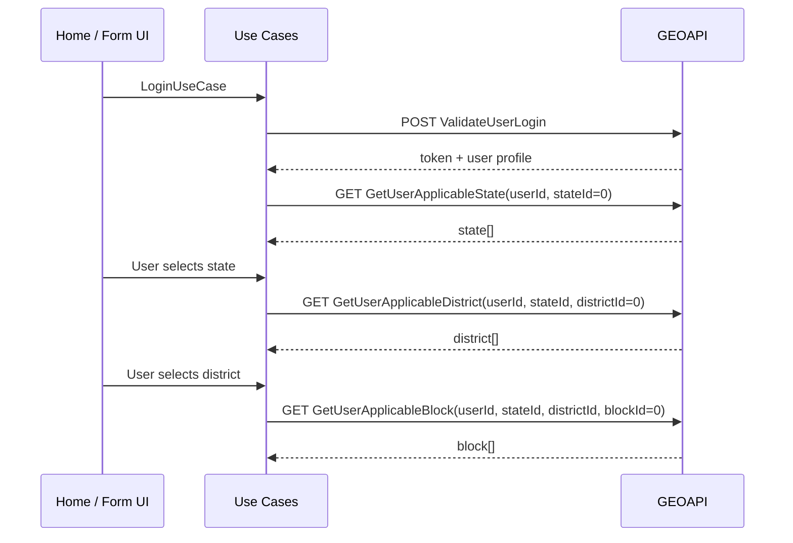

# ProjectGeo — API Specification

**Document Version:** 1.1  
**Created:** 2026-05-23  
**Updated:** 2026-06-13  
**Status:** Partial — Auth, jurisdiction & project endpoints documented  
**Related:** [`requirement.md`](./requirement.md) · [`architecture.md`](./architecture.md)

---

## 1. Overview

ProjectGeo integrates with the **GEOAPI** backend hosted at `https://webgap.in/GEOAPI`. This document defines available endpoints, request/response contracts, error handling, and frontend mapping guidance for the Clean Architecture layers.

### 1.1 Base URL

| Environment | Base URL |
|-------------|----------|
| Production (current) | `https://webgap.in/GEOAPI` |
| API prefix | `/api` |

**Full base:** `https://webgap.in/GEOAPI/api`

### 1.2 Implemented Endpoints (v1)

| # | Method | Endpoint | Purpose | Auth |
|---|--------|----------|---------|------|
| 1 | `POST` | `/UserDetails/ValidateUserLogin` | Login; returns JWT + user profile | No |
| 2 | `GET` | `/UserDetails/GetUserApplicableState` | States visible to user | TBD* |
| 3 | `GET` | `/UserDetails/GetUserApplicableDistrict` | Districts for user + state | TBD* |
| 4 | `GET` | `/UserDetails/GetUserApplicableBlock` | Blocks for user + state + district | TBD* |
| 5 | `POST` | `/UserDetails/InsertUpdateGeoProjectBasicInfo` | Create or update project basic info | TBD* |
| 6 | `GET` | `/UserDetails/GetGeoProjectList` | Paginated project list for user | TBD* |

\* Confirm with backend whether JWT `Authorization` header is required on GET jurisdiction calls. Until confirmed, send the token on all authenticated requests (recommended).

### 1.3 Pending Endpoints

These are planned per `requirement.md` but **not yet available** from the backend:

| Domain | Indicative Endpoint | Status |
|--------|---------------------|--------|
| Projects | Delete project | Pending |
| Analytics | Demographics, water, soil reports | Pending |
| Geo boundaries | State/district/block GeoJSON from API | Pending (static GeoJSON used for now) |
| Files | Upload AOI, documents, media | Pending |
| Logout / refresh token | Session invalidation | Pending |

---

## 2. Conventions

### 2.1 Transport

- Protocol: **HTTPS**
- Request body (POST): `Content-Type: application/json`
- Accept header: `text/plain` (server still returns JSON bodies)
- Character encoding: UTF-8

### 2.2 Authentication

Login returns a **JWT** in the `token` field. Subsequent requests SHOULD include:

```http
Authorization: Bearer <token>
```

**JWT claims (decoded example from login token):**

| Claim | Example | Notes |
|-------|---------|-------|
| `name` | `STMN001` | Matches `usp_user_id` |
| `role` | `User` | Generic JWT role; use `usp_group_code` for app RBAC |
| `exp` | Unix timestamp | Token expiry |
| `iss` | `GEOAPI` | Issuer |
| `aud` | `GEOUsers` | Audience |

Frontend MUST treat **`usp_group_code`** / **`usp_group_desc`** as the authoritative application role, not the JWT `role` claim.

### 2.3 Standard Response Envelope

Most responses share this shape:

```typescript
interface ApiEnvelope<TData = unknown> {
  statusCode: number;
  message: string;
  success: boolean | null;
  data: TData | null;
}
```

Login and jurisdiction endpoints extend the envelope with domain-specific arrays.

### 2.4 ID Parameter Convention

Query parameters ending in `Id` use **`0` to mean “all applicable records”** for the current user scope:

| Parameter | Value `0` means |
|-----------|-----------------|
| `stateId` | All applicable states |
| `districtId` | All applicable districts in the given state |
| `blockId` | All applicable blocks in the given district |

### 2.5 Success vs Empty Results

| Scenario | Typical pattern |
|----------|-----------------|
| Records found | Array populated, `success: true`, `message: "Record's found."` |
| No records | Empty array, `success: null`, `message: "No Records found!"` |
| Login failed | `success: false`, `statusCode: 400`, `user: null`, `token: null` |

Frontend MUST handle **empty arrays** without treating them as HTTP errors when `statusCode === 200`.

### 2.6 HTTP Status vs Body statusCode

The API may return HTTP 200 with `statusCode: 400` in the body for login failure. Always inspect **`success`** and **`statusCode`** in the response body, not HTTP status alone.

---

## 3. Auth & User

### 3.1 Validate User Login

Authenticates a user and returns a JWT plus profile metadata.

**Endpoint:** `POST /UserDetails/ValidateUserLogin`

#### Request

```bash
curl -X 'POST' \
  'https://webgap.in/GEOAPI/api/UserDetails/ValidateUserLogin' \
  -H 'accept: text/plain' \
  -H 'Content-Type: application/json' \
  -d '{
  "user_id": "STMN001",
  "password": "Abc@1975",
  "device_uuid": "testad"
}'
```

#### Request Body Schema

| Field | Type | Required | Description |
|-------|------|----------|-------------|
| `user_id` | `string` | Yes | Government user login ID (not email) |
| `password` | `string` | Yes | User password |
| `device_uuid` | `string` | Yes | Unique device identifier for session tracking |

**TypeScript DTO:**

```typescript
interface LoginRequestDto {
  user_id: string;
  password: string;
  device_uuid: string;
}
```

#### Success Response (`200`)

```json
{
  "token": "eyJhbGciOiJIUzI1NiIsInR5cCI6IkpXVCJ9...",
  "user": [
    {
      "usp_user_id": "STMN001",
      "usp_pswd": "Abc@1975",
      "usp_first_name": "Arnab",
      "usp_middle_name": "",
      "usp_last_name": "Dutta",
      "usp_group_code": "SM",
      "usp_group_desc": "STATE MANAGER",
      "usp_dept": "MANAGEMENT",
      "usp_mailid": "arnab@gmail.com",
      "usp_mobile": "7980396717",
      "usp_employee_id": "8888",
      "usp_reportee_user": "",
      "usp_active_yn": "Y"
    }
  ],
  "statusCode": 200,
  "message": "Login successful.",
  "success": true,
  "data": null
}
```

#### Failure Response (example)

```json
{
  "token": null,
  "user": null,
  "statusCode": 400,
  "message": "Login failed! Invalid user or password!",
  "success": false,
  "data": null
}
```

#### Response Schema

```typescript
interface LoginResponseDto extends ApiEnvelope<null> {
  token: string | null;
  user: UserProfileDto[] | null;
}

interface UserProfileDto {
  usp_user_id: string;
  usp_pswd: string;           // NEVER persist in frontend storage
  usp_first_name: string;
  usp_middle_name: string;
  usp_last_name: string;
  usp_group_code: string;       // RBAC key — see §3.2
  usp_group_desc: string;
  usp_dept: string;
  usp_mailid: string;
  usp_mobile: string;
  usp_employee_id: string;
  usp_reportee_user: string;
  usp_active_yn: 'Y' | 'N' | string;
}
```

#### Frontend Handling Rules

| Rule | Action |
|------|--------|
| `success === true` && `token` present | Store token in session; map `user[0]` to domain `User` |
| `success === false` or missing token | Show `message`; do not navigate |
| `usp_active_yn !== 'Y'` | Block login; show “Account inactive” |
| `usp_pswd` in response | Discard immediately; never store |
| `user` is array | Always use first element `user[0]` |

#### Domain Mapping (Infrastructure → Domain)

```typescript
// Map usp_group_code → domain UserRole (extend as codes are confirmed)
const GROUP_CODE_TO_ROLE: Record<string, UserRole> = {
  SM: UserRole.StateManager,   // STATE MANAGER
  DM: UserRole.DistrictManager, // TBD — confirm code
  BM: UserRole.BlockManager,    // TBD — confirm code
  AD: UserRole.Admin,           // TBD — confirm code
};
```

---

### 3.2 User Group Codes (RBAC)

| `usp_group_code` | `usp_group_desc` | Domain `UserRole` | Status |
|------------------|------------------|-------------------|--------|
| `SM` | STATE MANAGER | `state_manager` | Confirmed |
| `DM` | DISTRICT MANAGER | `district_manager` | Confirm with backend |
| `BM` | BLOCK MANAGER | `block_manager` | Confirm with backend |
| `AD` | ADMIN | `admin` | Confirm with backend |

Jurisdiction scope (which states/districts/blocks) comes from the **GetUserApplicable*** endpoints, not from the login payload alone.

---

## 4. Jurisdiction Dropdowns

Used to populate State → District → Block cascading filters on Home dashboard and project forms.

**Common rules:**

- Pass logged-in `userId` = `usp_user_id` from login.
- Use numeric IDs from previous dropdown selection when drilling down.
- Use `0` for “all applicable” at that level.

---

### 4.1 Get User Applicable State

Returns states the user is allowed to access.

**Endpoint:** `GET /UserDetails/GetUserApplicableState`

#### Request

```bash
curl -X 'GET' \
  'https://webgap.in/GEOAPI/api/UserDetails/GetUserApplicableState?userId=STMN001&stateId=0' \
  -H 'accept: text/plain'
```

#### Query Parameters

| Parameter | Type | Required | Description |
|-----------|------|----------|-------------|
| `userId` | `string` | Yes | `usp_user_id` from login |
| `stateId` | `number` | Yes | `0` = all applicable states; or specific state ID |

#### Success Response

```json
{
  "state": [
    {
      "tsm_state_id": 12,
      "tsm_state_name": "ARUNACHAL PRADESH"
    }
  ],
  "statusCode": 200,
  "message": "Record's found.",
  "success": true,
  "data": null
}
```

#### Response Schema

```typescript
interface ApplicableStateResponseDto extends ApiEnvelope<null> {
  state: StateItemDto[];
}

interface StateItemDto {
  tsm_state_id: number;
  tsm_state_name: string;
}
```

#### Domain Mapping

```typescript
// domain/value-objects or entity
class StateOption {
  constructor(
    public readonly id: number,
    public readonly name: string,
  ) {}
}
```

---

### 4.2 Get User Applicable District

Returns districts the user can access within a state.

**Endpoint:** `GET /UserDetails/GetUserApplicableDistrict`

#### Request

```bash
curl -X 'GET' \
  'https://webgap.in/GEOAPI/api/UserDetails/GetUserApplicableDistrict?userId=STMN001&stateId=12&districtId=0' \
  -H 'accept: text/plain'
```

#### Query Parameters

| Parameter | Type | Required | Description |
|-----------|------|----------|-------------|
| `userId` | `string` | Yes | `usp_user_id` |
| `stateId` | `number` | Yes | Selected `tsm_state_id` |
| `districtId` | `number` | Yes | `0` = all applicable districts |

#### Success Response

```json
{
  "district": [
    {
      "tdm_district_id": 12,
      "tdm_district_name": "CHANGLANG"
    }
  ],
  "statusCode": 200,
  "message": "Record's found.",
  "success": true,
  "data": null
}
```

#### Empty Response

```json
{
  "district": [],
  "statusCode": 200,
  "message": "No Records found!",
  "success": null,
  "data": null
}
```

#### Response Schema

```typescript
interface ApplicableDistrictResponseDto extends ApiEnvelope<null> {
  district: DistrictItemDto[];
}

interface DistrictItemDto {
  tdm_district_id: number;
  tdm_district_name: string;
}
```

---

### 4.3 Get User Applicable Block

Returns blocks the user can access within a district.

**Endpoint:** `GET /UserDetails/GetUserApplicableBlock`

#### Request

```bash
curl -X 'GET' \
  'https://webgap.in/GEOAPI/api/UserDetails/GetUserApplicableBlock?userId=STMN001&stateId=12&districtId=12&blockId=0' \
  -H 'accept: text/plain'
```

#### Query Parameters

| Parameter | Type | Required | Description |
|-----------|------|----------|-------------|
| `userId` | `string` | Yes | `usp_user_id` |
| `stateId` | `number` | Yes | Selected `tsm_state_id` |
| `districtId` | `number` | Yes | Selected `tdm_district_id` |
| `blockId` | `number` | Yes | `0` = all applicable blocks |

#### Success Response

```json
{
  "block": [
    {
      "tbm_block_id": 112,
      "tbm_block_name": "BORDUMSA"
    },
    {
      "tbm_block_id": 133,
      "tbm_block_name": "CHANGLANG"
    }
  ],
  "statusCode": 200,
  "message": "Record's found.",
  "success": true,
  "data": null
}
```

#### Response Schema

```typescript
interface ApplicableBlockResponseDto extends ApiEnvelope<null> {
  block: BlockItemDto[];
}

interface BlockItemDto {
  tbm_block_id: number;
  tbm_block_name: string;
}
```

---

## 5. Cascading Dropdown Flow



### 5.1 UI Binding Guide

| Dropdown | API field (label) | API field (value) | Depends on |
|----------|-------------------|-------------------|------------|
| State | `tsm_state_name` | `tsm_state_id` | Login |
| District | `tdm_district_name` | `tdm_district_id` | Selected state |
| Block | `tbm_block_name` | `tbm_block_id` | Selected district |

### 5.2 Name Normalization for GeoJSON

API names are **uppercase** (e.g. `CHANGLANG`, `ARUNACHAL PRADESH`). GeoJSON properties may use mixed case (e.g. `District N`, `Mouza Name`). Infrastructure mappers SHOULD normalize with case-insensitive comparison when matching boundaries to API dropdown values.

---

## 6. Projects

Used to submit new projects, update existing project basic info, and list projects for the logged-in user.

**Common rules:**

- Pass `gpbi_login_user` / `loginUserId` = `usp_user_id` from login.
- Use jurisdiction IDs (`gpbi_state_id`, `gpbi_district_id`, `gpbi_block_id`) from the **GetUserApplicable*** dropdown endpoints.
- Set `gpbi_id` to `0` for a new project; use the existing `gpbi_id` when updating.
- Date fields use `YYYY-MM-DD` format.

---

### 6.1 Insert / Update Geo Project Basic Info

Creates a new project or updates an existing one. On create, the backend assigns `gpbi_project_code` (visible in the list response).

**Endpoint:** `POST /UserDetails/InsertUpdateGeoProjectBasicInfo`

#### Request

```bash
curl -X 'POST' \
  'https://webgap.in/GEOAPI/api/UserDetails/InsertUpdateGeoProjectBasicInfo' \
  -H 'accept: text/plain' \
  -H 'Content-Type: application/json' \
  -d '{
  "gpbi_id": 0,
  "gpbi_project_type": "GPT_02",
  "gpbi_project_name": "TEST PROJECT",
  "gpbi_project_scheme_type": "GPS_01",
  "gpbi_state_id": 12,
  "gpbi_district_id": 10,
  "gpbi_block_id": 1,
  "gpbi_location_name": "Kolkata",
  "gpbi_nearest_landmark": "Behala",
  "gpbi_geo_location_type": "POINT",
  "gpbi_geo_location_lat": "41.40338",
  "gpbi_geo_location_long": "2.17403",
  "gpbi_geo_location_accuracy": "100",
  "gpbi_geo_location_length_area_vol": 0,
  "gpbi_project_assigned_to": "STEN001",
  "gpbi_contact_name": "Rajib Chakraborty",
  "gpbi_contact_number": "9051068874",
  "gpbi_project_status": "PENDING",
  "gpbi_login_user": "STMN001",
  "gpbi_active": "Y",
  "gpbi_contact_email_id": "rajib@gmail.com",
  "gpbi_planned_start_date": "2026-05-26",
  "gpbi_actual_start_date": "2026-05-27",
  "gpbi_planned_end_date": "2026-05-30",
  "gpbi_actual_end_date": "2026-05-31"
}'
```

#### Request Body Schema

| Field | Type | Required | Description |
|-------|------|----------|-------------|
| `gpbi_id` | `number` | Yes | `0` = insert; existing ID = update |
| `gpbi_project_type` | `string` | Yes | Project type code (e.g. `GPT_02`) |
| `gpbi_project_name` | `string` | Yes | Display name of the project |
| `gpbi_project_scheme_type` | `string` | Yes | Scheme type code (e.g. `GPS_01`) |
| `gpbi_state_id` | `number` | Yes | `tsm_state_id` from jurisdiction dropdown |
| `gpbi_district_id` | `number` | Yes | `tdm_district_id` from jurisdiction dropdown |
| `gpbi_block_id` | `number` | Yes | `tbm_block_id` from jurisdiction dropdown |
| `gpbi_location_name` | `string` | Yes | Location / village name |
| `gpbi_nearest_landmark` | `string` | Yes | Nearest landmark |
| `gpbi_geo_location_type` | `string` | Yes | Geo shape type (e.g. `POINT`) |
| `gpbi_geo_location_lat` | `string` | Yes | Latitude (string in API) |
| `gpbi_geo_location_long` | `string` | Yes | Longitude (string in API) |
| `gpbi_geo_location_accuracy` | `string` | Yes | GPS accuracy (metres) |
| `gpbi_geo_location_length_area_vol` | `number` | Yes | Length / area / volume; `0` for point |
| `gpbi_project_assigned_to` | `string` | Yes | Assigned user ID (e.g. `STEN001`) |
| `gpbi_contact_name` | `string` | Yes | On-site contact name |
| `gpbi_contact_number` | `string` | Yes | Contact phone number |
| `gpbi_contact_email_id` | `string` | Yes | Contact email |
| `gpbi_project_status` | `string` | Yes | Status code (e.g. `PENDING`) |
| `gpbi_login_user` | `string` | Yes | Submitting user's `usp_user_id` |
| `gpbi_active` | `'Y' \| 'N'` | Yes | Active flag |
| `gpbi_planned_start_date` | `string` | Yes | Planned start (`YYYY-MM-DD`) |
| `gpbi_actual_start_date` | `string` | No | Actual start (`YYYY-MM-DD`) |
| `gpbi_planned_end_date` | `string` | Yes | Planned end (`YYYY-MM-DD`) |
| `gpbi_actual_end_date` | `string` | No | Actual end (`YYYY-MM-DD`) |

**TypeScript DTO:**

```typescript
interface GeoProjectBasicInfoRequestDto {
  gpbi_id: number;
  gpbi_project_type: string;
  gpbi_project_name: string;
  gpbi_project_scheme_type: string;
  gpbi_state_id: number;
  gpbi_district_id: number;
  gpbi_block_id: number;
  gpbi_location_name: string;
  gpbi_nearest_landmark: string;
  gpbi_geo_location_type: string;
  gpbi_geo_location_lat: string;
  gpbi_geo_location_long: string;
  gpbi_geo_location_accuracy: string;
  gpbi_geo_location_length_area_vol: number;
  gpbi_project_assigned_to: string;
  gpbi_contact_name: string;
  gpbi_contact_number: string;
  gpbi_contact_email_id: string;
  gpbi_project_status: string;
  gpbi_login_user: string;
  gpbi_active: 'Y' | 'N' | string;
  gpbi_planned_start_date: string;
  gpbi_actual_start_date?: string;
  gpbi_planned_end_date: string;
  gpbi_actual_end_date?: string;
}
```

#### Success Response (`200`)

```json
{
  "statusCode": 200,
  "message": "Data submitted successfully.",
  "success": true
}
```

#### Response Schema

```typescript
interface GeoProjectSubmitResponseDto {
  statusCode: number;
  message: string;
  success: boolean;
}
```

#### Frontend Handling Rules

| Rule | Action |
|------|--------|
| `success === true` | Show success toast; refresh project list |
| `gpbi_id === 0` on submit | Treat as create; backend assigns `gpbi_project_code` |
| `gpbi_id > 0` on submit | Treat as update of existing record |
| Validation failure | Show `message` from response body |

---

### 6.2 Get Geo Project List

Returns a paginated list of projects visible to the logged-in user.

**Endpoint:** `GET /UserDetails/GetGeoProjectList`

#### Request

```bash
curl -X 'GET' \
  'https://webgap.in/GEOAPI/api/UserDetails/GetGeoProjectList?loginUserId=STMN001&currentPageNo=1&noOfPagesToGet=50&activeYn=Y' \
  -H 'accept: text/plain'
```

#### Query Parameters

| Parameter | Type | Required | Description |
|-----------|------|----------|-------------|
| `loginUserId` | `string` | Yes | `usp_user_id` from login |
| `currentPageNo` | `number` | Yes | 1-based page number |
| `noOfPagesToGet` | `number` | Yes | Page size (records per request) |
| `activeYn` | `'Y' \| 'N'` | Yes | Filter by active flag |

#### Success Response

```json
{
  "geoProjectList": [
    {
      "gpbi_id": 1,
      "gpbi_project_code": "GP-0526-000001",
      "gpbi_project_type": "GPT_02",
      "gpbi_project_type_name": "FOREST & HORTICULTURE",
      "gpbi_project_name": "TEST PROJECT",
      "gpbi_project_scheme_type": "GPS_01",
      "gpbi_project_scheme_type_name": "PLANTATION",
      "gpbi_state_id": 12,
      "gpbi_state_name": "ARUNACHAL PRADESH",
      "gpbi_district_id": 10,
      "gpbi_district_name": "DIBANG VALLEY",
      "gpbi_block_id": 1,
      "gpbi_block_name": "MIPI",
      "gpbi_location_name": "Kolkata",
      "gpbi_nearest_landmark": "Behala",
      "gpbi_geo_location_type": "POINT",
      "gpbi_geo_location_lat": "41.40338",
      "gpbi_geo_location_long": "2.17403",
      "gpbi_geo_location_accuracy": "100",
      "gpbi_geo_location_length_area_vol": 0,
      "gpbi_project_assigned_to": "STEN001",
      "gpbi_project_assigned_to_user_name": "Rajib Chakraborty",
      "gpbi_contact_name": "Rajib Chakraborty",
      "gpbi_contact_number": "9051068874",
      "gpbi_contact_email_id": "rajib@gmail.com",
      "gpbi_project_status": "PENDING",
      "gpbi_project_remarks": "",
      "gpbi_project_created_on": "2026-05-28",
      "gpbi_planned_start_date": "2026-05-26",
      "gpbi_actual_start_date": "2026-05-27",
      "gpbi_planned_end_date": "2026-05-30",
      "gpbi_actual_end_date": "2026-05-31",
      "gpbi_active": "Y"
    }
  ],
  "statusCode": 200,
  "message": "Record's found.",
  "success": true,
  "data": null
}
```

#### Response Schema

```typescript
interface GeoProjectListResponseDto extends ApiEnvelope<null> {
  geoProjectList: GeoProjectListItemDto[];
}

interface GeoProjectListItemDto {
  gpbi_id: number;
  gpbi_project_code: string;
  gpbi_project_type: string;
  gpbi_project_type_name: string;
  gpbi_project_name: string;
  gpbi_project_scheme_type: string;
  gpbi_project_scheme_type_name: string;
  gpbi_state_id: number;
  gpbi_state_name: string;
  gpbi_district_id: number;
  gpbi_district_name: string;
  gpbi_block_id: number;
  gpbi_block_name: string;
  gpbi_location_name: string;
  gpbi_nearest_landmark: string;
  gpbi_geo_location_type: string;
  gpbi_geo_location_lat: string;
  gpbi_geo_location_long: string;
  gpbi_geo_location_accuracy: string;
  gpbi_geo_location_length_area_vol: number;
  gpbi_project_assigned_to: string;
  gpbi_project_assigned_to_user_name: string;
  gpbi_contact_name: string;
  gpbi_contact_number: string;
  gpbi_contact_email_id: string;
  gpbi_project_status: string;
  gpbi_project_remarks: string;
  gpbi_project_created_on: string;
  gpbi_planned_start_date: string;
  gpbi_actual_start_date: string;
  gpbi_planned_end_date: string;
  gpbi_actual_end_date: string;
  gpbi_active: 'Y' | 'N' | string;
}
```

#### Domain Mapping

```typescript
// Map list item → domain ProjectSummary entity
class ProjectSummary {
  constructor(
    public readonly id: number,
    public readonly code: string,
    public readonly name: string,
    public readonly typeName: string,
    public readonly schemeTypeName: string,
    public readonly stateName: string,
    public readonly districtName: string,
    public readonly blockName: string,
    public readonly status: string,
    public readonly createdOn: string,
    public readonly active: boolean,
  ) {}
}
```

#### UI Binding Guide

| UI column | API field |
|-----------|-----------|
| Project code | `gpbi_project_code` |
| Project name | `gpbi_project_name` |
| Type | `gpbi_project_type_name` |
| Scheme | `gpbi_project_scheme_type_name` |
| State / District / Block | `gpbi_state_name` / `gpbi_district_name` / `gpbi_block_name` |
| Status | `gpbi_project_status` |
| Created on | `gpbi_project_created_on` |
| Assigned to | `gpbi_project_assigned_to_user_name` |

---

## 7. Error Handling

### 7.1 Login Errors

| Condition | User message (from API) | Frontend action |
|-----------|-------------------------|-----------------|
| Invalid credentials | `Login failed! Invalid user or password!` | Stay on login; clear password field |
| Inactive account | TBD | Block access; contact admin message |
| Network failure | — | “Unable to connect. Check network.” |
| Malformed response | — | Log + generic error |

### 7.2 Jurisdiction Errors

| Condition | Frontend action |
|-----------|-----------------|
| `district: []` with HTTP 200 | Show empty district dropdown; disable block dropdown |
| `block: []` with HTTP 200 | Show empty block dropdown |
| HTTP 401 / expired JWT | Clear session; redirect to login |
| HTTP 5xx | Retry once; then show error toast |

### 7.3 Application Error Mapping

```typescript
// infrastructure/http/api-response.mapper.ts
function assertApiSuccess<T>(response: ApiEnvelope<T> & { success?: boolean | null }): void {
  if (response.success === false || (response.statusCode >= 400 && response.success !== true)) {
    throw new ApplicationError(response.message || 'Request failed', String(response.statusCode));
  }
}
```

---

## 8. Frontend Integration (Clean Architecture)

### 8.1 Infrastructure Repositories

| Repository | Methods | API |
|------------|---------|-----|
| `AuthApiRepository` | `login()`, `getCurrentUser()` | `ValidateUserLogin` |
| `JurisdictionApiRepository` | `getStates()`, `getDistricts()`, `getBlocks()` | `GetUserApplicable*` |
| `ProjectApiRepository` | `submitProject()`, `getProjectList()` | `InsertUpdateGeoProjectBasicInfo`, `GetGeoProjectList` |

### 8.2 Application Use Cases

| Use Case | Calls |
|----------|-------|
| `LoginUseCase` | `AuthRepository.login` → store token → optional prefetch states |
| `LogoutUseCase` | Clear token + jurisdiction cache |
| `GetApplicableStatesUseCase` | `JurisdictionRepository.getStates(userId, 0)` |
| `GetApplicableDistrictsUseCase` | `JurisdictionRepository.getDistricts(userId, stateId, 0)` |
| `GetApplicableBlocksUseCase` | `JurisdictionRepository.getBlocks(userId, stateId, districtId, 0)` |
| `SubmitProjectUseCase` | `ProjectRepository.submitProject(dto)` |
| `GetProjectListUseCase` | `ProjectRepository.getProjectList(userId, page, pageSize, activeYn)` |

### 8.3 Session Storage Keys

| Key | Content |
|-----|---------|
| `geo_auth_token` | JWT string |
| `geo_user_profile` | Sanitized `UserProfileDto` (no password) |
| `geo_device_uuid` | Generated once per browser install |

**Device UUID generation:**

```typescript
function getOrCreateDeviceUuid(): string {
  let uuid = localStorage.getItem('geo_device_uuid');
  if (!uuid) {
    uuid = crypto.randomUUID?.() ?? `web-${Date.now()}-${Math.random().toString(36).slice(2)}`;
    localStorage.setItem('geo_device_uuid', uuid);
  }
  return uuid;
}
```

### 8.4 HTTP Interceptor

```typescript
// core/interceptors/auth.interceptor.ts
export const authInterceptor: HttpInterceptorFn = (req, next) => {
  const token = sessionStorage.getItem('geo_auth_token');
  if (token && req.url.includes('/GEOAPI/')) {
    req = req.clone({ setHeaders: { Authorization: `Bearer ${token}` } });
  }
  return next(req);
};
```

### 8.5 Angular Environment

```typescript
// environments/environment.ts
export const environment = {
  production: false,
  apiBaseUrl: 'https://webgap.in/GEOAPI/api',
  useLocalData: false,
};
```

```typescript
// infrastructure/http/api-client.service.ts
@Injectable({ providedIn: 'root' })
export class ApiClientService {
  private readonly baseUrl = environment.apiBaseUrl;

  url(path: string): string {
    return `${this.baseUrl}${path.startsWith('/') ? path : `/${path}`}`;
  }
}
```

---

## 9. Login UI Change Impact

The current app login form uses **email + password**. The API expects **`user_id` + password + device_uuid**.

| Current field | API field | UI label (recommended) |
|---------------|-----------|--------------------------|
| `email` | `user_id` | User ID |
| `password` | `password` | Password |
| — | `device_uuid` | Hidden (auto-generated) |

---

## 10. Security Notes

- Never commit real credentials to source control.
- Do not persist `usp_pswd` from login response.
- Store JWT in `sessionStorage` (cleared on tab close) unless SSO policy requires otherwise.
- Validate token expiry client-side from JWT `exp` before long sessions; redirect to login when expired.
- All production calls over HTTPS only.
- Rate-limit login attempts in UI (disable button briefly after failures).

---

## 11. Testing

### 11.1 Manual cURL Checklist

- [ ] Login success with valid `user_id` / `password`
- [ ] Login failure with wrong password
- [ ] Get states with `stateId=0`
- [ ] Get districts for `stateId=12`
- [ ] Get blocks for `stateId=12&districtId=12`
- [ ] Empty district/block list handling
- [ ] Submit new project with `gpbi_id=0`
- [ ] Get project list with pagination (`currentPageNo`, `noOfPagesToGet`)
- [ ] Update existing project with `gpbi_id > 0`

### 11.2 HttpTestingController Example

```typescript
it('maps login response to User entity', () => {
  const mock: LoginResponseDto = { /* ... success payload ... */ };
  authRepo.login({ user_id: 'STMN001', password: 'x', device_uuid: 'test' }).subscribe(user => {
    expect(user.role).toBe(UserRole.StateManager);
    expect(user.id).toBe('STMN001');
  });
  const req = httpMock.expectOne(`${environment.apiBaseUrl}/UserDetails/ValidateUserLogin`);
  expect(req.request.method).toBe('POST');
  req.flush(mock);
});
```

---

## 12. Changelog

| Version | Date | Changes |
|---------|------|---------|
| 1.0 | 2026-05-23 | Initial document: login, state, district, block endpoints |
| 1.1 | 2026-06-13 | Added project submit (`InsertUpdateGeoProjectBasicInfo`) and list (`GetGeoProjectList`) endpoints |

---

## 13. Open Items for Backend Team

| # | Question |
|---|----------|
| Q-01 | Are `GetUserApplicable*` endpoints protected by Bearer token? |
| Q-02 | Complete list of `usp_group_code` values (DM, BM, Admin)? |
| Q-03 | Should login use email (`usp_mailid`) or only `user_id`? |
| Q-04 | Logout / token refresh endpoint? |
| Q-05 | Valid values for `gpbi_project_type`, `gpbi_project_scheme_type`, `gpbi_project_status`, `gpbi_geo_location_type`? |
| Q-06 | Analytics endpoints for water/soil/demographics? |
| Q-07 | Mapping between `tdm_district_id` / `tbm_block_id` and GeoJSON feature IDs? |
| Q-08 | Project delete endpoint and soft-delete via `gpbi_active`? |

---

*End of Document*
