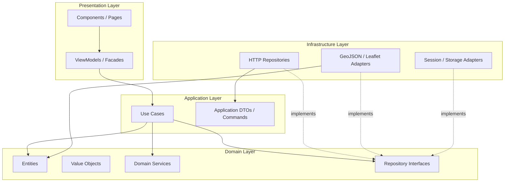
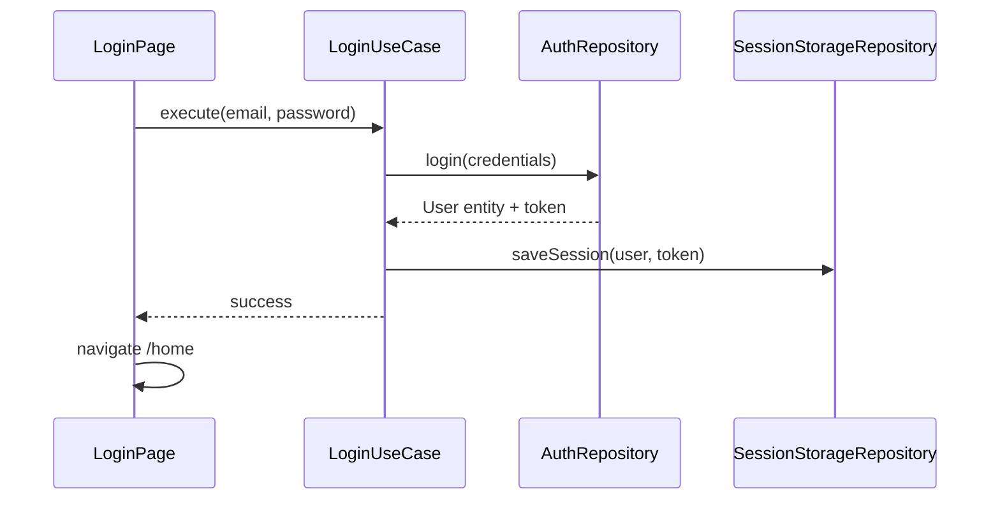
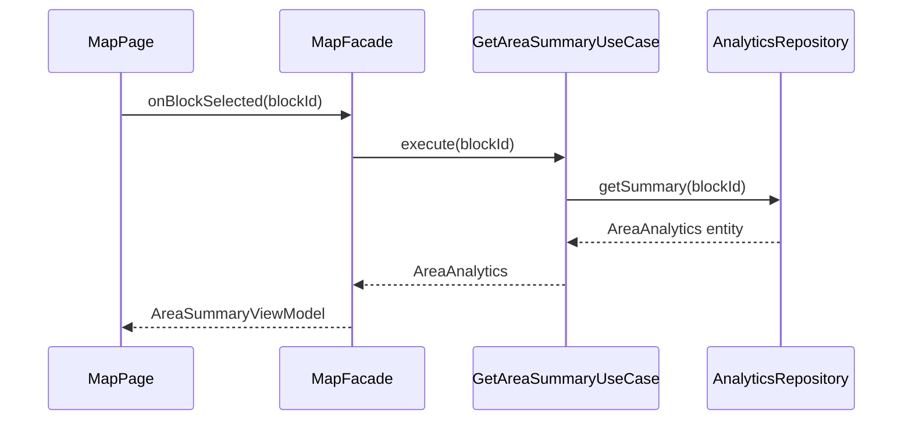

# ProjectGeo — Software Architecture Document

**Document Version:** 1.0  
**Created:** 2026-05-23  
**Status:** Draft  
**Related:** [`requirement.md`](./requirement.md)

---

## 1. Purpose

This document defines the **target software architecture** for the ProjectGeo revamp. It establishes:

- **Clean Architecture** with explicit **Domain**, **Application**, **Infrastructure**, and **Presentation** layers
- **Class-based** entities, value objects, use cases, repositories, and presentation models
- **SOLID** principles applied to every layer
- **Coding standards** consistent with the existing technology stack

The goal is a maintainable, testable, government-grade frontend that can evolve from dummy/local data to production APIs without rewriting UI or business rules.

---

## 2. Technical Stack (Unchanged)

The architecture preserves the stack defined in `requirement.md` and already used in the project.

| Category | Technology | Version / Notes |
|----------|------------|-----------------|
| Framework | Angular | 20.x (standalone components) |
| Language | TypeScript | 5.9, `strict: true` |
| Maps | Leaflet.js | 1.9 + `@types/leaflet` |
| UI | Bootstrap | 5.3 |
| Icons | Font Awesome | 7.x |
| Styling | SCSS | Theme variables (`_light-theme`, `_dark-theme`) |
| Reactive | RxJS | 7.8 |
| SSR | Angular SSR | Express server; map/chart features are browser-only |
| Build | Angular CLI / `@angular/build` | Production output → IIS via `web.config` |
| Testing | Jasmine + Karma | Unit tests per layer |

**Runtime constraints**

- Map, GeoJSON parsing, and Leaflet MUST run only in the browser (`isPlatformBrowser` guard).
- SSR routes render shell/layout; heavy geo logic initializes in `ngAfterViewInit` or lazy browser providers.
- Zoneless change detection is enabled (`provideZonelessChangeDetection`); prefer **signals** and explicit `ChangeDetectorRef` only when integrating third-party DOM libs (Leaflet).

---

## 3. Architectural Style — Clean Architecture

### 3.1 Core Rule: Dependency Direction

Dependencies MUST point **inward**. Outer layers depend on inner abstractions, never the reverse.



| Layer | Responsibility | Depends On |
|-------|----------------|------------|
| **Domain** | Business entities, invariants, domain logic, repository **contracts** | Nothing external |
| **Application** | Orchestration, use cases, authorization checks at app level | Domain |
| **Infrastructure** | API, GeoJSON files, Leaflet, localStorage, file upload | Domain (+ Angular HTTP) |
| **Presentation** | UI, routing, user input, formatting for display | Application (+ Angular) |

### 3.2 What Each Layer MUST NOT Do

| Layer | Forbidden |
|-------|-----------|
| Domain | Import `@angular/*`, `leaflet`, `rxjs`, DOM APIs, HTTP |
| Application | Import Leaflet, Bootstrap, component templates |
| Infrastructure | Contain UI formatting or route logic |
| Presentation | Call `HttpClient` directly; embed business rules; filter projects by role inline |

---

## 4. Target Folder Structure

Refactor from the current flat `src/app/services` layout into layer-first modules with **feature slices** inside Presentation.

```
src/
├── app/
│   ├── core/                              # App bootstrap, guards, interceptors
│   │   ├── guards/
│   │   │   └── auth.guard.ts
│   │   ├── interceptors/
│   │   │   └── auth.interceptor.ts
│   │   └── providers/
│   │       └── infrastructure.providers.ts
│   │
│   ├── domain/                            # PURE TypeScript — no Angular imports
│   │   ├── entities/
│   │   │   ├── user.entity.ts
│   │   │   ├── project.entity.ts
│   │   │   ├── geo-boundary.entity.ts
│   │   │   └── area-analytics.entity.ts
│   │   ├── value-objects/
│   │   │   ├── coordinates.vo.ts
│   │   │   ├── jurisdiction.vo.ts
│   │   │   ├── money.vo.ts
│   │   │   └── role.enum.ts
│   │   ├── repositories/                  # Interfaces (ports)
│   │   │   ├── auth.repository.ts
│   │   │   ├── project.repository.ts
│   │   │   ├── geo.repository.ts
│   │   │   └── analytics.repository.ts
│   │   ├── services/                      # Domain services (pure logic)
│   │   │   ├── jurisdiction-filter.service.ts
│   │   │   └── project-validation.service.ts
│   │   └── errors/
│   │       └── domain.error.ts
│   │
│   ├── application/                       # Use cases
│   │   ├── auth/
│   │   │   ├── login.use-case.ts
│   │   │   ├── logout.use-case.ts
│   │   │   └── get-current-user.use-case.ts
│   │   ├── projects/
│   │   │   ├── get-projects-by-jurisdiction.use-case.ts
│   │   │   ├── create-project.use-case.ts
│   │   │   ├── update-project.use-case.ts
│   │   │   └── delete-project.use-case.ts
│   │   ├── geo/
│   │   │   ├── get-districts.use-case.ts
│   │   │   ├── get-blocks-by-district.use-case.ts
│   │   │   └── resolve-location.use-case.ts
│   │   ├── analytics/
│   │   │   └── get-area-summary.use-case.ts
│   │   └── mappers/                       # DTO ↔ Entity (if not in infra)
│   │       └── project.mapper.ts
│   │
│   ├── infrastructure/                    # Adapters (implements domain ports)
│   │   ├── http/
│   │   │   ├── api-client.service.ts
│   │   │   ├── auth-api.repository.ts
│   │   │   ├── project-api.repository.ts
│   │   │   └── analytics-api.repository.ts
│   │   ├── geo/
│   │   │   ├── geojson-file.repository.ts
│   │   │   ├── leaflet-map.adapter.ts
│   │   │   └── polygon-utils.ts
│   │   ├── persistence/
│   │   │   ├── session-storage.repository.ts
│   │   │   └── local-project.repository.ts    # Dev/demo only
│   │   └── tokens/
│   │       └── repository.tokens.ts
│   │
│   ├── presentation/                      # UI layer
│   │   ├── shared/
│   │   │   ├── components/
│   │   │   │   ├── pie-chart/
│   │   │   │   ├── bar-chart/
│   │   │   │   └── loader/
│   │   │   └── layout/
│   │   │       ├── header/
│   │   │       └── pre-loader/
│   │   ├── features/
│   │   │   ├── login/
│   │   │   │   ├── login.page.ts
│   │   │   │   ├── login.page.html
│   │   │   │   ├── login.page.scss
│   │   │   │   └── login.presenter.ts
│   │   │   ├── home/
│   │   │   │   ├── home.page.ts
│   │   │   │   ├── home.facade.ts
│   │   │   │   └── models/
│   │   │   │       └── home.view-model.ts
│   │   │   ├── map/
│   │   │   │   ├── map.page.ts
│   │   │   │   ├── map.facade.ts
│   │   │   │   ├── components/
│   │   │   │   │   ├── project-detail-panel/
│   │   │   │   │   └── area-summary-panel/
│   │   │   │   └── models/
│   │   │   │       └── map.view-model.ts
│   │   │   └── project/
│   │   │       ├── project-form/
│   │   │       └── project-map-picker/
│   │   └── state/                         # Optional: signal stores per feature
│   │       └── map-selection.store.ts
│   │
│   ├── app.routes.ts
│   ├── app.config.ts
│   └── app.ts
│
├── assets/
│   ├── data/                              # Legacy JS geo bundles (migrate to geojson/)
│   └── geojson/
│       └── ARUNACHAL_PRADESH_BLOCK.geojson
└── styles/
```

### 4.1 Path Aliases (Recommended)

Add to `tsconfig.app.json`:

```json
{
  "compilerOptions": {
    "paths": {
      "@domain/*": ["src/app/domain/*"],
      "@application/*": ["src/app/application/*"],
      "@infrastructure/*": ["src/app/infrastructure/*"],
      "@presentation/*": ["src/app/presentation/*"],
      "@core/*": ["src/app/core/*"]
    }
  }
}
```

### 4.2 Migration Map (Current → Target)

| Current Location | Target Location |
|------------------|-----------------|
| `services/auth/auth.ts` | `infrastructure/persistence/` + `application/auth/` + `domain/entities/user.entity.ts` |
| `services/project/project.ts` | `application/projects/` + `infrastructure/http/project-api.repository.ts` |
| `data/dummy-project-data.ts` | `infrastructure/persistence/local-project.repository.ts` |
| `map/map.ts` (2400+ lines) | Split: `presentation/features/map/` + `infrastructure/geo/leaflet-map.adapter.ts` + facades |
| `map-selection.service.ts` | `presentation/state/map-selection.store.ts` |
| `shared/pie-chart/` | `presentation/shared/components/pie-chart/` |
| `theme.service.ts` | `presentation/shared/` or `core/` |

---

## 5. Layer Specifications

### 5.1 Domain Layer

**Purpose:** Express business concepts and rules independent of UI and infrastructure.

#### 5.1.1 Entities (Classes)

Entities have identity and lifecycle. They encapsulate invariants.

```typescript
// domain/entities/project.entity.ts
import { Coordinates } from '../value-objects/coordinates.vo';
import { Jurisdiction } from '../value-objects/jurisdiction.vo';
import { Money } from '../value-objects/money.vo';

export class Project {
  constructor(
    public readonly id: string,
    public projectName: string,
    public activityName: string,
    public schemeType: string,
    public locationName: string,
    public coordinates: Coordinates,
    public jurisdiction: Jurisdiction,
    public estimatedCost: Money | null,
    public finalCost: Money | null,
    public fundType: string,
    public beneficiaryName: string,
    public beneficiaryDetails: string,
  ) {}

  isWithin(jurisdiction: Jurisdiction): boolean {
    return this.jurisdiction.isInside(jurisdiction);
  }

  renameActivity(name: string): void {
    if (!name.trim()) {
      throw new DomainError('Activity name is required');
    }
    this.activityName = name.trim();
  }
}
```

```typescript
// domain/entities/user.entity.ts
import { Jurisdiction } from '../value-objects/jurisdiction.vo';
import { UserRole } from '../value-objects/role.enum';

export class User {
  constructor(
    public readonly id: number,
    public name: string,
    public email: string,
    public role: UserRole,
    public jurisdiction: Jurisdiction,
    public permissions: ReadonlyArray<string>,
  ) {}

  can(permission: string): boolean {
    return this.permissions.includes(permission);
  }

  canAccessDistrict(districtName: string): boolean {
    return this.jurisdiction.includesDistrict(districtName);
  }

  canAccessBlock(districtName: string, blockName: string): boolean {
    return this.jurisdiction.includesBlock(districtName, blockName);
  }
}
```

#### 5.1.2 Value Objects (Classes)

Immutable; equality by value.

```typescript
// domain/value-objects/coordinates.vo.ts
export class Coordinates {
  private constructor(
    public readonly latitude: number,
    public readonly longitude: number,
  ) {}

  static create(lat: number | null, lng: number | null): Coordinates {
    if (lat === null || lng === null) {
      throw new DomainError('Coordinates are required');
    }
    if (lat < -90 || lat > 90 || lng < -180 || lng > 180) {
      throw new DomainError('Coordinates out of range');
    }
    return new Coordinates(lat, lng);
  }
}
```

```typescript
// domain/value-objects/jurisdiction.vo.ts
import { UserRole } from './role.enum';

export class Jurisdiction {
  constructor(
    public readonly states: ReadonlyArray<string>,
    public readonly districts: ReadonlyArray<string>,
    public readonly blocks: ReadonlyArray<string>,
    public readonly role: UserRole,
  ) {}

  includesDistrict(district: string): boolean {
    if (this.role === UserRole.StateManager || this.role === UserRole.Admin) {
      return true;
    }
    return this.districts.includes('ALL') || this.districts.includes(district);
  }

  includesBlock(district: string, block: string): boolean {
    if (!this.includesDistrict(district)) return false;
    if (this.role === UserRole.StateManager || this.role === UserRole.Admin) {
      return true;
    }
    if (this.role === UserRole.DistrictManager) {
      return this.blocks.includes('ALL') || this.blocks.includes(block);
    }
    return this.blocks.includes(block);
  }

  isInside(other: Jurisdiction): boolean {
    // Used for project-in-jurisdiction checks
    return this.includesDistrict(other.districts[0] ?? '');
  }
}
```

#### 5.1.3 Repository Interfaces (Ports)

```typescript
// domain/repositories/project.repository.ts
import { Observable } from 'rxjs'; // Acceptable in port return types OR use Promise — pick one project-wide
import { Project } from '../entities/project.entity';
import { User } from '../entities/user.entity';

export abstract class ProjectRepository {
  abstract getAllForUser(user: User): Observable<Project[]>;
  abstract getById(id: string): Observable<Project | null>;
  abstract create(project: Project): Observable<Project>;
  abstract update(project: Project): Observable<Project>;
  abstract delete(id: string): Observable<void>;
}
```

> **Note:** Domain layer ideally has zero RxJS. Alternative: use `Promise` in ports and wrap in Observables in Application/Infrastructure. **Project standard:** interfaces may return `Observable<T>` for Angular consistency, but Domain entity/value-object files MUST NOT import RxJS.

#### 5.1.4 Domain Services

Pure logic that does not belong on a single entity.

```typescript
// domain/services/jurisdiction-filter.service.ts
import { Project } from '../entities/project.entity';
import { User } from '../entities/user.entity';

export class JurisdictionFilterService {
  filterProjects(projects: Project[], user: User): Project[] {
    return projects.filter((p) => p.isWithin(user.jurisdiction));
  }
}
```

---

### 5.2 Application Layer

**Purpose:** Execute application-specific workflows by coordinating domain objects and repositories.

Each **Use Case = one class, one public method** (`execute`).

```typescript
// application/projects/get-projects-by-jurisdiction.use-case.ts
import { inject, Injectable } from '@angular/core';
import { Observable, map, switchMap } from 'rxjs';
import { Project } from '@domain/entities/project.entity';
import { JurisdictionFilterService } from '@domain/services/jurisdiction-filter.service';
import { ProjectRepository } from '@domain/repositories/project.repository';
import { AuthRepository } from '@domain/repositories/auth.repository';

@Injectable({ providedIn: 'root' })
export class GetProjectsByJurisdictionUseCase {
  private readonly projectRepo = inject(ProjectRepository);
  private readonly authRepo = inject(AuthRepository);
  private readonly filterService = new JurisdictionFilterService();

  execute(): Observable<Project[]> {
    return this.authRepo.getCurrentUser().pipe(
      switchMap((user) => {
        if (!user) return [];
        return this.projectRepo.getAllForUser(user).pipe(
          map((projects) => this.filterService.filterProjects(projects, user)),
        );
      }),
    );
  }
}
```

**Application layer rules**

- Use cases are `@Injectable` and registered in `root` or feature providers.
- No HTML, SCSS, Leaflet, or `localStorage` direct access.
- Map infrastructure DTOs to entities via dedicated mappers.
- Throw application errors (`ApplicationError`) for expected failures; let infrastructure translate HTTP errors.

---

### 5.3 Infrastructure Layer

**Purpose:** Implement repository interfaces and external system adapters.

#### 5.3.1 Dependency Injection Bindings

```typescript
// infrastructure/tokens/repository.tokens.ts
import { InjectionToken } from '@angular/core';
import { ProjectRepository } from '@domain/repositories/project.repository';

export const PROJECT_REPOSITORY = new InjectionToken<ProjectRepository>('ProjectRepository');
```

```typescript
// core/providers/infrastructure.providers.ts
import { Provider } from '@angular/core';
import { PROJECT_REPOSITORY } from '@infrastructure/tokens/repository.tokens';
import { ProjectApiRepository } from '@infrastructure/http/project-api.repository';
import { LocalProjectRepository } from '@infrastructure/persistence/local-project.repository';
import { environment } from '../../environments/environment';

export const infrastructureProviders: Provider[] = [
  {
    provide: PROJECT_REPOSITORY,
    useClass: environment.useLocalData ? LocalProjectRepository : ProjectApiRepository,
  },
  // AuthRepository, GeoRepository, AnalyticsRepository ...
];
```

#### 5.3.2 HTTP Repository Example

```typescript
// infrastructure/http/project-api.repository.ts
import { inject, Injectable } from '@angular/core';
import { HttpClient } from '@angular/common/http';
import { Observable, map } from 'rxjs';
import { ProjectRepository } from '@domain/repositories/project.repository';
import { ProjectMapper } from '../mappers/project.mapper';

@Injectable()
export class ProjectApiRepository extends ProjectRepository {
  private readonly http = inject(HttpClient);
  private readonly baseUrl = '/api/projects';

  getAllForUser(user: User): Observable<Project[]> {
    return this.http
      .get<ProjectDto[]>(this.baseUrl)
      .pipe(map((dtos) => dtos.map(ProjectMapper.toDomain)));
  }
}
```

#### 5.3.3 Leaflet Adapter (Infrastructure, not Presentation)

Leaflet is an external detail. Wrap it behind an adapter interface.

```typescript
// infrastructure/geo/leaflet-map.adapter.ts
export abstract class MapAdapter {
  abstract initialize(containerId: string, options: MapInitOptions): void;
  abstract setDistrictLayer(geoJson: GeoJsonObject): void;
  abstract setBlockLayer(geoJson: GeoJsonObject): void;
  abstract setProjectMarkers(markers: ProjectMarkerDto[]): void;
  abstract onDistrictClick(handler: (districtName: string) => void): void;
  abstract onBlockClick(handler: (blockName: string) => void): void;
  abstract onMarkerClick(handler: (projectId: string) => void): void;
  abstract destroy(): void;
}
```

Presentation components inject `MapAdapter` (or a `MapFacade` that uses it) — they MUST NOT import Leaflet directly except inside the adapter implementation file.

#### 5.3.4 GeoJSON Repository

```typescript
// infrastructure/geo/geojson-file.repository.ts
@Injectable()
export class GeoJsonFileRepository extends GeoRepository {
  loadDistricts(scope: GeoScope): Observable<FeatureCollection> { /* ... */ }
  loadBlocks(scope: GeoScope): Observable<FeatureCollection> { /* ... */ }
}
```

Static assets live under `src/assets/geojson/`. Large files load lazily per district where possible.

---

### 5.4 Presentation Layer

**Purpose:** Display data, capture input, delegate all business work to Application layer.

#### 5.4.1 Component Types

| Type | Suffix | Responsibility |
|------|--------|----------------|
| Page | `.page.ts` | Route entry; minimal logic |
| Presenter / Facade | `.presenter.ts` / `.facade.ts` | Calls use cases; exposes signals to template |
| View Model | `.view-model.ts` | UI-specific shape (formatted currency, labels) |
| Dumb Component | `.component.ts` | `@Input` / `@Output` only; no use case injection |

#### 5.4.2 Facade Pattern (Recommended)

```typescript
// presentation/features/home/home.facade.ts
import { inject, Injectable, signal } from '@angular/core';
import { GetProjectsByJurisdictionUseCase } from '@application/projects/get-projects-by-jurisdiction.use-case';

@Injectable()
export class HomeFacade {
  private readonly getProjects = inject(GetProjectsByJurisdictionUseCase);

  readonly projects = signal<ProjectViewModel[]>([]);
  readonly loading = signal(false);
  readonly error = signal<string | null>(null);

  loadProjects(): void {
    this.loading.set(true);
    this.getProjects.execute().subscribe({
      next: (entities) => {
        this.projects.set(entities.map(ProjectViewModel.fromEntity));
        this.loading.set(false);
      },
      error: (err) => {
        this.error.set(err.message);
        this.loading.set(false);
      },
    });
  }
}
```

#### 5.4.3 Page Component

```typescript
// presentation/features/home/home.page.ts
@Component({
  selector: 'app-home',
  imports: [CommonModule, MapPage, ProjectSidebarComponent],
  providers: [HomeFacade],
  templateUrl: './home.page.html',
})
export class HomePage implements OnInit {
  protected readonly facade = inject(HomeFacade);

  ngOnInit(): void {
    this.facade.loadProjects();
  }
}
```

**Presentation rules**

- Templates contain no business filtering (no `*ngIf="user.role === 'block_manager'"` for data access — use facade computed signals).
- Format pipes for display only; domain validation stays in Domain/Application.
- Split `map.ts` monolith into: `MapPage` + `AreaSummaryPanelComponent` + `ProjectDetailPanelComponent` + `MapFacade` + `LeafletMapAdapter`.

---

## 6. SOLID Principles — ProjectGeo Application

### 6.1 Single Responsibility Principle (SRP)

**Rule:** One class, one reason to change.

| Bad (current) | Good (target) |
|---------------|---------------|
| `MapComponent` handles Leaflet, charts, auth, projects, drag UI | `LeafletMapAdapter`, `MapFacade`, `AreaSummaryPanelComponent`, `GetAreaSummaryUseCase` |
| `AuthService` holds dummy users + login + localStorage | `User` entity, `AuthRepository`, `LoginUseCase`, `SessionStorageRepository` |
| `Project` service filters by role + reads localStorage | `JurisdictionFilterService`, `ProjectRepository`, use cases |

### 6.2 Open/Closed Principle (OCP)

**Rule:** Open for extension, closed for modification.

- Swap `LocalProjectRepository` → `ProjectApiRepository` via DI without changing use cases.
- Add new chart types by new `ChartComponent` implementations, not by editing `AreaSummaryPanel`.
- Add new roles by extending `Jurisdiction` rules and permissions, not scattered `if (role)` in components.

### 6.3 Liskov Substitution Principle (LSP)

**Rule:** Implementations must honor repository contracts.

- Any `ProjectRepository` implementation MUST return domain `Project` entities, not raw DTOs.
- Mock repositories used in tests MUST behave like production repos (same filtering guarantees).

### 6.4 Interface Segregation Principle (ISP)

**Rule:** Small, focused interfaces.

Split large repos:

```typescript
abstract class ProjectReader {
  abstract getAllForUser(user: User): Observable<Project[]>;
  abstract getById(id: string): Observable<Project | null>;
}

abstract class ProjectWriter {
  abstract create(project: Project): Observable<Project>;
  abstract update(project: Project): Observable<Project>;
  abstract delete(id: string): Observable<void>;
}
```

Use cases depend only on what they need (`ProjectReader` for list views).

### 6.5 Dependency Inversion Principle (DIP)

**Rule:** Depend on abstractions, not concretions.

- Use cases inject `ProjectRepository` (abstract), not `HttpClient`.
- Components inject `HomeFacade`, not `GetProjectsByJurisdictionUseCase` directly (optional but improves template stability).
- Environment-specific bindings live in `infrastructure.providers.ts` only.

---

## 7. Coding Standards

### 7.1 TypeScript

| Rule | Standard |
|------|----------|
| Strict mode | Always on (`strict: true`) |
| Types | No `any` except Leaflet internals in adapter; use `unknown` + type guards |
| Immutability | Prefer `readonly` on entity fields set at construction |
| Nullability | Use explicit `| null`; avoid implicit undefined in public APIs |
| Enums | Use `const enum` or string union types (`UserRole`) in domain |
| Files | One public class per file; file name = kebab-case of class |
| Barrel exports | Avoid large `index.ts` re-exports that create circular deps |

### 7.2 Angular

| Rule | Standard |
|------|----------|
| Components | Standalone (no NgModules) |
| Change detection | Zoneless; use `signal`, `computed`, `effect` |
| Inputs/Outputs | Prefer `input()` / `output()` signal APIs for new code |
| Services in UI | Facades/Presenters for pages; no god services |
| Templates | Keep logic minimal; use `@if` / `@for` (Angular 17+ control flow) |
| SSR safety | Guard browser-only code with `isPlatformBrowser` |
| Routes | Lazy-load feature pages where bundle size grows |
| Guards | `AuthGuard` on `/home`, `/projects`, `/map` |

### 7.3 Naming Conventions

| Artifact | Convention | Example |
|----------|------------|---------|
| Entity | PascalCase + `Entity` optional | `Project`, `User` |
| Value Object | PascalCase | `Coordinates`, `Jurisdiction` |
| Use Case | Verb phrase + `UseCase` | `CreateProjectUseCase` |
| Repository interface | Noun + `Repository` | `ProjectRepository` |
| Repository impl | Noun + source + `Repository` | `ProjectApiRepository` |
| Facade | Feature + `Facade` | `HomeFacade` |
| Page component | Feature + `Page` | `HomePage` |
| View model | Feature + `ViewModel` | `ProjectViewModel` |
| SCSS partial | `_name.scss` | `_map-panel.scss` |
| Constants | UPPER_SNAKE_CASE | `MAX_UPLOAD_SIZE_MB` |

### 7.4 File Size Limits

| Layer | Max lines (guideline) |
|-------|----------------------|
| Page template | 150 |
| Component class | 200 |
| Facade | 250 |
| Use case | 80 |
| Entity / VO | 120 |
| Leaflet adapter | 400 (split by concern if larger) |

When `map.ts` exceeds limits, split immediately — this is a revamp priority.

### 7.5 Error Handling

```typescript
// domain/errors/domain.error.ts
export class DomainError extends Error {
  constructor(message: string) {
    super(message);
    this.name = 'DomainError';
  }
}

// application/errors/application.error.ts
export class ApplicationError extends Error {
  constructor(
    message: string,
    public readonly code: string,
  ) {
    super(message);
  }
}
```

| Layer | Handles |
|-------|---------|
| Domain | Invalid invariants, illegal state transitions |
| Application | Not found, unauthorized action, validation aggregation |
| Infrastructure | HTTP status mapping → `ApplicationError` |
| Presentation | Display user-friendly message; log technical detail |

### 7.6 Logging

- Use a single `LoggerService` in Infrastructure.
- No `console.log` in Domain or Application (except temporary debug during development).
- Log API failures with correlation id when backend supports it.

### 7.7 SCSS / UI

- Use theme variables from `src/styles/_theme-variables.scss`.
- Component styles scoped to component; no global leakage.
- Bootstrap utilities for layout; custom SCSS for brand (navbar gradient, map panels).
- BEM-like naming for complex map overlays: `.map-panel`, `.map-panel__header`.

### 7.8 Git & Code Review Checklist

Every PR MUST verify:

- [ ] No inward layer violations (Domain does not import Angular)
- [ ] New feature has use case + tests
- [ ] Repository accessed only from Application/Infrastructure
- [ ] Role/jurisdiction logic not duplicated in templates
- [ ] Browser-only APIs guarded for SSR
- [ ] No hardcoded demo credentials in production build

---

## 8. Cross-Cutting Concerns

### 8.1 Authentication Flow



`AuthInterceptor` (Infrastructure) attaches token to HTTP requests.

### 8.2 Authorization

| Check | Where |
|-------|-------|
| Route access | `AuthGuard` (Presentation/Core) |
| Action permission (`can('add_projects')`) | Use case before write operations |
| Data scope (district/block) | Domain `Jurisdiction` + `JurisdictionFilterService` |
| API enforcement | Backend (frontend checks are UX only) |

### 8.3 Map + Analytics Data Flow



### 8.4 Environment Configuration

```typescript
// environments/environment.ts
export const environment = {
  production: false,
  apiBaseUrl: 'https://api.example.gov.in',
  useLocalData: true, // toggle LocalProjectRepository vs ProjectApiRepository
  defaultState: 'Arunachal Pradesh',
};
```

---

## 9. Testing Strategy

| Layer | Test Type | Tools | Focus |
|-------|-----------|-------|-------|
| Domain | Unit | Jasmine | Entity invariants, jurisdiction rules, validators |
| Application | Unit | Jasmine + mocks | Use case orchestration |
| Infrastructure | Unit / Integration | Jasmine + HttpTestingController | API mapping, error mapping |
| Presentation | Component | TestBed | Facade wiring, template rendering |
| E2E | Optional future | Playwright/Cypress | Login → map → project pin |

**Example domain test:**

```typescript
it('block manager cannot access other block projects', () => {
  const user = UserFactory.blockManager('DIBANG VALLEY', 'ANINI');
  const projects = [
    ProjectFactory.inBlock('DIBANG VALLEY', 'ANINI'),
    ProjectFactory.inBlock('DIBANG VALLEY', 'OTHER'),
  ];
  const result = new JurisdictionFilterService().filterProjects(projects, user);
  expect(result.length).toBe(1);
});
```

---

## 10. Performance Guidelines

| Concern | Approach |
|---------|----------|
| Large GeoJSON | Lazy load blocks per district; simplify geometries |
| Map markers | Cluster when > 50 pins in viewport |
| Change detection | Signals + facades; avoid manual CD in new code except Leaflet bridge |
| Bundle size | Lazy routes for `/projects` form |
| API | Cache district list in memory; invalidate on logout |

---

## 11. Security Guidelines

- Store tokens in `sessionStorage` or httpOnly cookie (prefer cookie when backend supports).
- Never embed API keys in frontend for Google tiles; use approved tile URLs only.
- Sanitize user-generated HTML in project descriptions before render.
- Strip demo users from production builds via environment flag.
- Validate file upload type/size in Application layer before Infrastructure upload.

---

## 12. Deployment Architecture

Unchanged from current setup:

```
Browser → IIS (static + web.config URL rewrite)
       → Angular SPA (dist/ProjectGeo/browser)
       → REST API (external backend)
       → GeoJSON assets (/assets/geojson/)
```

`web.config` handles SPA fallback routing. SSR server optional for initial shell hydration.

---

## 13. Implementation Roadmap (Architecture)

| Phase | Deliverable |
|-------|-------------|
| **A1** | Create folder structure + path aliases + `infrastructure.providers.ts` |
| **A2** | Extract Domain entities (`User`, `Project`, `Jurisdiction`, `Coordinates`) |
| **A3** | Define repository interfaces + Local implementations (wrap existing dummy data) |
| **A4** | Implement core use cases (login, list projects, get area summary) |
| **A5** | Introduce `HomeFacade`, `MapFacade`; thin page components |
| **A6** | Extract `LeafletMapAdapter` from monolithic `map.ts` |
| **A7** | Swap to `ProjectApiRepository` when `api.md` is ready |
| **A8** | Delete legacy god services after parity testing |

---

## 14. Related Documents

| Document | Purpose |
|----------|---------|
| [`requirement.md`](./requirement.md) | Functional & non-functional requirements |
| `api.md` | REST contracts (pending) |
| `architecture.md` | This document — structure, SOLID, standards |

---

## 15. Architecture Decision Records (Summary)

| ID | Decision | Rationale |
|----|----------|-----------|
| ADR-01 | Clean Architecture on Angular SPA | Separates gov business rules from Leaflet/API details |
| ADR-02 | Class-based entities & VOs | Aligns with user requirement; improves testability |
| ADR-03 | Use cases as injectable classes | One workflow per class; SRP |
| ADR-04 | Facades in Presentation | Keeps components thin under zoneless CD |
| ADR-05 | Leaflet behind `MapAdapter` | DIP; map library swappable |
| ADR-06 | Keep existing tech stack | No framework migration risk |
| ADR-07 | Signals over BehaviorSubject for new UI state | Matches Angular 20 zoneless config |

---

*End of Document*
