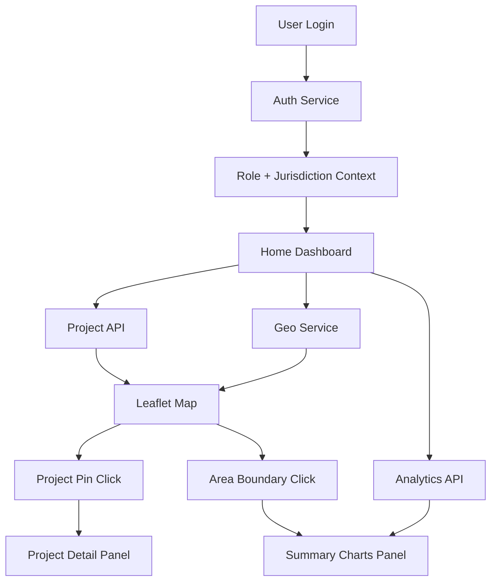

# ProjectGeo — Product Requirements Document

**Document Version:** 1.0  
**Created:** 2026-05-23  
**Status:** Draft  
**Project:** ProjectGeo — Government Geo-Spatial Project Monitoring Platform

---

## 1. Executive Summary

ProjectGeo is a web application for government officials to monitor, manage, and analyze development projects across a state using interactive maps and data dashboards. The platform supports a three-tier administrative hierarchy — **State Manager**, **District Manager**, and **Block Manager** — with role-based visibility into projects and geographic areas.

The application combines **Leaflet.js** map visualization, **GeoJSON** boundary layers (state, district, block), project pin markers, and graphical area summaries (demographics, water, soil, caste, and related reports). Users can browse projects by geography, create new projects, and view detailed summaries at state, district, block, and project levels.

This document defines the target requirements for revamping the existing Angular application into a production-ready government monitoring system. API contracts will be documented separately in `api.md` once backend cURL examples are provided. UI/UX will align with shared Figma designs.

---

## 2. Project Context

### 2.1 Problem Statement

State governments run multiple schemes and projects across districts and blocks. Officials at different administrative levels need a single platform to:

- See which project types/schemes are active in their jurisdiction
- Filter and drill down by district and block
- Visualize project locations on a map
- Understand local area conditions through summary analytics
- Create and track new project applications

### 2.2 Reference Geography

Initial deployment targets **Arunachal Pradesh**, with extensibility for other states.

| Administrative Level | Example | Geo Boundary Source |
|---------------------|---------|---------------------|
| State | Arunachal Pradesh | State boundary GeoJSON |
| District | Dibang Valley, Tawang, etc. | District GeoJSON |
| Block / Mouza / Circle | Anini, Ziro, etc. | Block GeoJSON (`ARUNACHAL_PRADESH_BLOCK.geojson`) |

> **Note:** The codebase currently uses "Mouza" and "Block" interchangeably. The revamp should standardize terminology in UI labels while preserving backend field compatibility.

### 2.3 Current Application Baseline

The existing codebase (Angular 20 + Leaflet 1.9) already implements:

| Area | Current State |
|------|---------------|
| Authentication | Email/password login with role-based dummy users (`AuthService`) |
| Roles | `admin`, `state_manager`, `district_manager`, `block_manager` |
| Home dashboard | State/district/block dropdowns, project sidebar, embedded map |
| Map | Leaflet with district/block layers, project markers, info panels |
| Project CRUD | 5-step project application form with map-based location selection |
| Data storage | `localStorage` with dummy project dataset |
| Charts | Custom SVG pie charts for gender and caste (sample/random data) |
| Geo data | JS-loaded district/mouza files + block-level GeoJSON with census attributes |
| Theming | Light/dark theme support, Bootstrap 5 UI |

### 2.4 Revamp Goals

1. Replace dummy/local data with real backend APIs
2. Complete area analytics (water, soil, caste, gender) with API-driven charts
3. Align UI with Figma designs
4. Harden role-based access and geographic filtering
5. Improve map performance for large GeoJSON datasets
6. Deliver production deployment (IIS via `web.config`)

---

## 3. Stakeholders & User Roles

### 3.1 Primary Users

| Role | Scope | Primary Goals |
|------|-------|---------------|
| **State Manager** | Entire state | View all project types across state; filter by any district; monitor statewide summaries |
| **District Manager** | Assigned district(s) only | View/manage projects within own district; analyze district and block data |
| **Block Manager** | Assigned block(s) only | View/manage projects within own block; analyze block-level data |
| **Admin** *(system)* | Full access | System administration, user management, all data visibility |

### 3.2 Role-Based Access Matrix

| Capability | State Manager | District Manager | Block Manager | Admin |
|------------|:-------------:|:----------------:|:-------------:|:-----:|
| View state-wide projects | ✅ | ❌ | ❌ | ✅ |
| Select any district | ✅ | ❌ (own only) | ❌ (own only) | ✅ |
| Select any block | ✅ | ✅ (within district) | ❌ (own only) | ✅ |
| View project list | ✅ (filtered by selection) | ✅ | ✅ | ✅ |
| View project on map | ✅ | ✅ | ✅ | ✅ |
| Create project | ⚠️ TBD | ✅ | ✅ | ✅ |
| Edit project | ⚠️ TBD | ✅ (own scope) | ✅ (own scope) | ✅ |
| Delete project | ❌ | ⚠️ TBD | ⚠️ TBD | ✅ |
| View area analytics | ✅ | ✅ | ✅ | ✅ |
| Export reports | ⚠️ TBD | ⚠️ TBD | ⚠️ TBD | ✅ |

> **TBD items** require confirmation during API and policy design.

### 3.3 Example User Journeys

**State Manager — Monitor statewide schemes**
1. Login → land on Home dashboard with full state map
2. See aggregated project count by scheme type
3. Select a district from dropdown → map zooms, district highlights, projects filter
4. Click a project pin → project detail panel opens
5. Click district/block boundary → area summary panel shows demographic charts

**District Manager — Track district projects**
1. Login → map auto-zooms to assigned district
2. District dropdown pre-selected and locked to assigned district
3. Browse block list within district
4. Create new project via multi-step form
5. Plot project location on map and submit

**Block Manager — Manage block-level work**
1. Login → map auto-zooms to assigned block
2. See only projects within assigned block
3. View block-level water/soil/caste summaries on map click
4. Update existing project details

---

## 4. Functional Requirements

### 4.1 Authentication & Session Management

| ID | Requirement | Priority |
|----|-------------|----------|
| FR-AUTH-01 | System SHALL provide secure login (email + password minimum; SSO optional future) | P1 |
| FR-AUTH-02 | System SHALL persist authenticated session and restore on page reload | P1 |
| FR-AUTH-03 | System SHALL attach user role, state, district(s), and block(s) to session context | P1 |
| FR-AUTH-04 | System SHALL restrict routes and API calls based on user role and jurisdiction | P1 |
| FR-AUTH-05 | System SHALL provide logout and clear session data | P1 |
| FR-AUTH-06 | System SHALL redirect unauthenticated users to login page | P1 |

### 4.2 Home Dashboard & Project Overview

| ID | Requirement | Priority |
|----|-------------|----------|
| FR-DASH-01 | After login, user SHALL see a dashboard with map and project sidebar | P1 |
| FR-DASH-02 | Dashboard SHALL show projects filtered by user role and jurisdiction | P1 |
| FR-DASH-03 | User SHALL filter projects by state, district, and block via dropdown selectors | P1 |
| FR-DASH-04 | State Manager SHALL be able to select any district; District/Block managers SHALL see only assigned areas | P1 |
| FR-DASH-05 | Project sidebar SHALL support search by activity name, location, scheme type, beneficiary | P2 |
| FR-DASH-06 | Dashboard SHALL display project count badge and scheme/type breakdown summary | P2 |
| FR-DASH-07 | Selecting a project in sidebar SHALL center map on project pin and open detail panel | P1 |
| FR-DASH-08 | Dashboard SHALL support date-based filtering (date picker in UI — behavior TBD with API) | P3 |
| FR-DASH-09 | User SHALL switch map base layers (Satellite, OpenStreetMap, Google Streets, Hybrid, etc.) | P2 |

### 4.3 Leaflet Map & GeoJSON Visualization

| ID | Requirement | Priority |
|----|-------------|----------|
| FR-MAP-01 | System SHALL render an interactive Leaflet map as the primary geographic view | P1 |
| FR-MAP-02 | System SHALL load and display GeoJSON boundaries for **state**, **district**, and **block** levels | P1 |
| FR-MAP-03 | Clicking a district boundary SHALL highlight it, zoom map, load child blocks, and show district summary | P1 |
| FR-MAP-04 | Clicking a block boundary SHALL highlight it and show block-level summary | P1 |
| FR-MAP-05 | System SHALL plot project locations as map pin markers within user's visible scope | P1 |
| FR-MAP-06 | Clicking a project pin SHALL open a project detail panel with tabs: Info, Beneficiaries, Documentation, Photo/Video | P1 |
| FR-MAP-07 | Map SHALL sync with Home dropdown selections (district/block) bidirectionally | P1 |
| FR-MAP-08 | Initial map viewport SHALL auto-fit based on user role (state view / district view / block view) | P1 |
| FR-MAP-09 | System SHALL support marker tooltips showing project name and address on hover | P2 |
| FR-MAP-10 | Block GeoJSON (`ARUNACHAL_PRADESH_BLOCK.geojson`) SHALL be used as authoritative block layer with census attributes | P1 |
| FR-MAP-11 | Map component SHALL remain performant with large GeoJSON (lazy load, simplify geometries, or vector tiles as needed) | P2 |

**GeoJSON Data Attributes (Block layer — existing sample fields):**

- Identity: `Mouza Name`, `DISTRICT_N`, `NAME`, `CENSUS_COD`
- Population: `TOT_P`, `TOT_M`, `TOT_F`, `No_HH`
- Demographics: `P_SC`, `M_SC`, `F_SC`, `P_ST`, `M_ST`, `F_ST`
- Literacy: `P_LIT`, `M_LIT`, `F_LIT`

### 4.4 Area Summary & Analytics Panel

When a user clicks a **map location**, **district**, **block**, or **project area**, a summary panel SHALL appear with graphical representations.

| ID | Requirement | Priority |
|----|-------------|----------|
| FR-ANLY-01 | System SHALL show area summary panel on geographic selection (district/block/click) | P1 |
| FR-ANLY-02 | Summary SHALL include **Male / Female population comparison** (pie or bar chart) | P1 |
| FR-ANLY-03 | Summary SHALL include **Caste / community distribution** report (chart + legend) | P1 |
| FR-ANLY-04 | Summary SHALL include **Water report** (availability, quality indicators, scheme coverage — chart/table) | P1 |
| FR-ANLY-05 | Summary SHALL include **Soil report** (soil type, fertility, land use — chart/table) | P1 |
| FR-ANLY-06 | All summary metrics SHALL be rendered as charts/graphs (pie, bar, donut, or line as appropriate) | P1 |
| FR-ANLY-07 | Summary data SHALL scope to selected geography (state → district → block hierarchy) | P1 |
| FR-ANLY-08 | Summary panel SHALL show total population and key metadata (state, district, block names) | P1 |
| FR-ANLY-09 | Charts SHALL use API data in production; census GeoJSON MAY serve as fallback for demographics | P2 |
| FR-ANLY-10 | Summary panel SHALL be dismissible and non-blocking (side panel or overlay) | P2 |

**Chart types (minimum set):**

| Report | Suggested Visualization | Data Source |
|--------|------------------------|-------------|
| Gender distribution | Pie / donut chart | Census / demographics API |
| Caste distribution | Pie / stacked bar chart | Census / demographics API |
| Water report | Bar chart + KPI cards | Water resources API |
| Soil report | Bar / categorical chart | Soil survey API |
| Project scheme mix | Bar or donut chart | Projects API |

### 4.5 Project Management

| ID | Requirement | Priority |
|----|-------------|----------|
| FR-PROJ-01 | Authorized users SHALL create new projects via multi-step application form | P1 |
| FR-PROJ-02 | Project form SHALL capture: project name, activity/scheme, scheme type, location, coordinates, district, block, costs, fund type, beneficiary details | P1 |
| FR-PROJ-03 | User SHALL define project location by clicking on map or entering lat/long | P1 |
| FR-PROJ-04 | User SHALL optionally upload AOI (Area of Interest) GeoJSON/file for project boundary | P2 |
| FR-PROJ-05 | User SHALL upload supporting documents (beneficiary docs, plans, tenders, media) | P2 |
| FR-PROJ-06 | Authorized users SHALL edit existing projects within their jurisdiction | P1 |
| FR-PROJ-07 | System SHALL validate required fields before submission | P1 |
| FR-PROJ-08 | New/edited projects SHALL appear on map immediately after save | P1 |
| FR-PROJ-09 | Project detail view SHALL open in same tab or new tab (`/projects` route) | P2 |
| FR-PROJ-10 | System SHALL support predefined scheme catalog (MGNREGA, PHED, PMGSY, etc.) with option to add custom entries | P2 |

**Project Entity (minimum fields):**

```
projectName, activityName, schemeType, locationName,
latitude, longitude, districtName, mouzaName (block),
estimatedCost, finalCost, fundType,
beneficiaryName, beneficiaryDetails,
aoiFile, documents[], media[]
```

### 4.6 API Integration

| ID | Requirement | Priority |
|----|-------------|----------|
| FR-API-01 | Frontend SHALL consume REST APIs for auth, projects, geo boundaries, and analytics | P1 |
| FR-API-02 | All data currently in `localStorage` SHALL migrate to API-backed services | P1 |
| FR-API-03 | API requests SHALL include auth token and enforce server-side role filtering | P1 |
| FR-API-04 | Separate `api.md` SHALL document endpoints, request/response schemas, and cURL examples | P1 |
| FR-API-05 | System SHALL handle API errors gracefully with user-friendly messages | P2 |
| FR-API-06 | System SHALL show loading indicators during API calls | P2 |

**Planned API domains** *(to be finalized in `api.md`)*:

| Domain | Endpoints (indicative) |
|--------|------------------------|
| Auth | `POST /auth/login`, `POST /auth/logout`, `GET /auth/me` |
| Projects | `GET /projects`, `POST /projects`, `PUT /projects/:id`, `DELETE /projects/:id` |
| Geography | `GET /geo/state`, `GET /geo/districts`, `GET /geo/blocks`, `GET /geo/boundaries` |
| Analytics | `GET /analytics/demographics`, `GET /analytics/water`, `GET /analytics/soil` |
| Files | `POST /files/upload`, `GET /files/:id` |

### 4.7 Navigation & Layout

| ID | Requirement | Priority |
|----|-------------|----------|
| FR-NAV-01 | App SHALL provide routes: `/login`, `/home`, `/projects`, `/map` | P1 |
| FR-NAV-02 | Header SHALL show Home, Projects links and user profile menu (theme toggle, logout) | P2 |
| FR-NAV-03 | UI SHALL follow Figma design specifications for layout, colors, typography, and components | P1 |
| FR-NAV-04 | Application SHALL support responsive layout for desktop and tablet (mobile TBD) | P2 |

---

## 5. Non-Functional Requirements

| ID | Category | Requirement |
|----|----------|-------------|
| NFR-01 | Performance | Map initial load ≤ 5 seconds on standard gov network |
| NFR-02 | Performance | Project list filter/search response ≤ 1 second (client) / ≤ 3 seconds (API) |
| NFR-03 | Security | HTTPS in production; no credentials in client code |
| NFR-04 | Security | Role-based data isolation enforced on backend, not client-only |
| NFR-05 | Accessibility | Form labels, keyboard navigation, sufficient color contrast |
| NFR-06 | Browser | Latest Chrome, Edge, Firefox (primary targets) |
| NFR-07 | Deployment | Production build deployable to IIS with SPA routing (`web.config`) |
| NFR-08 | Maintainability | Angular standalone components; shared services for auth, projects, map, analytics |
| NFR-09 | Scalability | Support multiple states via configurable geo datasets |
| NFR-10 | Audit | Log project create/update/delete with user and timestamp (backend) |

---

## 6. Technical Architecture (Target)

### 6.1 Frontend Stack

| Layer | Technology |
|-------|------------|
| Framework | Angular 20 (standalone components) |
| Maps | Leaflet.js 1.9 + `@types/leaflet` |
| UI | Bootstrap 5, Font Awesome 7 |
| Charts | Existing SVG pie chart component; extend or adopt Chart.js/ngx-charts for bar/line |
| Styling | SCSS with theme variables (light/dark) |
| SSR | Angular SSR (existing; map features browser-only) |

### 6.2 Key Frontend Modules (Target Structure)

```
src/app/
├── login/                  # Authentication
├── home/                   # Dashboard + sidebar + embedded map
├── map/                    # Leaflet map, geo layers, markers, panels
├── project/
│   ├── insert-update-project/   # Multi-step CRUD form
│   └── map-for-insert/          # Map picker for new projects
├── shared/
│   └── charts/             # Pie, bar, KPI chart components
├── services/
│   ├── auth/               # Auth + role context
│   ├── project/            # Project API
│   ├── geo/                # GeoJSON loading + boundaries
│   └── analytics/          # Demographics, water, soil reports
└── geojson/                # Static GeoJSON assets (or API-fetched)
```

### 6.3 Data Flow



---

## 7. UI/UX & Design Reference

### 7.1 Figma Designs

The product owner has shared Figma designs covering login, dashboard, map views, project forms, and summary panels. Implementation MUST align with these designs for:

- Login screen layout and branding
- Dashboard header filters (date, state, district, block)
- Project sidebar cards and search
- Map overlays and detail panels
- Project application stepper form
- Chart/summary panel styling

> **Action Required:** Add Figma file URLs to this section when available. Until then, existing implemented screens serve as interim reference.

### 7.2 Existing UI Patterns to Preserve

- Orbitron font branding ("Project Geo")
- Dark navbar with gradient accent
- Project cards with scheme type icon badges
- Draggable project detail panel on map
- 5-step project application stepper

---

## 8. User Stories & Acceptance Criteria

### US-01 — Role-Based Login (P1)

**As a** government official  
**I want to** log in with my role credentials  
**So that** I only see projects and areas within my jurisdiction

**Acceptance Criteria:**
- Valid credentials redirect to `/home`
- Invalid credentials show error message
- Session persists across browser refresh
- District Manager cannot access other districts' projects
- Block Manager cannot access other blocks' projects

---

### US-02 — State-Wide Project Overview (P1)

**As a** State Manager  
**I want to** see all running project types in my state and filter by district  
**So that** I can monitor statewide scheme progress

**Acceptance Criteria:**
- All districts appear in district dropdown
- Project list updates when district is selected
- Map highlights selected district and shows relevant pins
- Project count reflects filtered results

---

### US-03 — Interactive Map with Project Pins (P1)

**As a** any authorized user  
**I want to** see project pins on a Leaflet map and click them for details  
**So that** I can understand where work is happening geographically

**Acceptance Criteria:**
- Pins appear at project lat/long coordinates
- Click opens detail panel with project info tabs
- Pin click does not break district/block selection state
- Only in-scope projects are shown per role

---

### US-04 — Area Summary on Map Click (P1)

**As a** any authorized user  
**I want to** click a district, block, or map area and see summary analytics  
**So that** I can understand local demographics and resource conditions

**Acceptance Criteria:**
- Summary panel shows gender comparison chart
- Summary panel shows caste/community chart
- Summary panel shows water report (graphical)
- Summary panel shows soil report (graphical)
- Data scopes to clicked geography
- Panel can be closed without losing map state

---

### US-05 — Create New Project (P1)

**As a** District or Block Manager  
**I want to** create a new project with map-based location  
**So that** it appears in monitoring dashboards and maps

**Acceptance Criteria:**
- Multi-step form validates required fields
- User picks coordinates on map
- District and block auto-populate from map selection where possible
- Saved project appears in sidebar and on map
- Project is scoped to creator's jurisdiction

---

### US-06 — API-Backed Data (P1)

**As a** system operator  
**I want** all project and analytics data served via APIs  
**So that** the application is production-ready and multi-user safe

**Acceptance Criteria:**
- No dependency on `localStorage` for production data
- `api.md` documents all endpoints
- Frontend services use HTTP client with error handling
- Backend enforces role-based filtering

---

## 9. Out of Scope (v1)

- Mobile-native apps (iOS/Android)
- Offline map mode
- Real-time collaborative editing
- SMS/email notifications
- Multi-state tenant administration UI
- Advanced GIS editing (draw custom polygons beyond AOI upload)
- Payment/disbursement tracking

---

## 10. Assumptions & Dependencies

| # | Assumption |
|---|------------|
| A-01 | Backend REST API will be provided by the government IT team |
| A-02 | GeoJSON boundary files for state/district/block are accurate and licensed for use |
| A-03 | Water and soil report APIs or datasets will be available per block/district |
| A-04 | Figma designs are final or change-controlled before development sprints |
| A-05 | Users access the app via desktop/laptop on government networks |
| A-06 | English is the primary UI language for v1 |

| # | Dependency |
|---|------------|
| D-01 | Backend API with authentication |
| D-02 | GeoJSON / geospatial data services |
| D-03 | Demographics, water, and soil data sources |
| D-04 | Figma design files |
| D-05 | IIS or equivalent hosting for production |

---

## 11. Success Criteria

| ID | Metric | Target |
|----|--------|--------|
| SC-01 | State Manager can filter and view projects for any district | 100% of districts selectable |
| SC-02 | Role isolation | Zero cross-jurisdiction data leaks in QA |
| SC-03 | Map interaction | Project pin click → detail panel ≤ 2 seconds |
| SC-04 | Area summary | All 4 report types render for district and block selection |
| SC-05 | Project creation | End-to-end create flow completable in ≤ 10 minutes |
| SC-06 | API migration | 0 production features dependent on localStorage |
| SC-07 | Design parity | ≥ 90% visual match to Figma on key screens |

---

## 12. Implementation Phases (Recommended)

### Phase 1 — Foundation (P1)
- Finalize `requirement.md` and `api.md`
- API service layer + auth integration
- Role-based project listing and map pins
- GeoJSON state/district/block layers on Leaflet

### Phase 2 — Analytics (P1)
- Area summary panel with gender, caste, water, soil charts
- API integration for analytics endpoints
- Replace dummy chart data

### Phase 3 — Project CRUD & Polish (P2)
- API-backed project create/edit/delete
- File upload integration
- Figma UI alignment pass
- Performance optimization for GeoJSON

### Phase 4 — Production Readiness (P2)
- Security review, error handling, loading states
- IIS deployment verification
- UAT with State/District/Block test users
- Documentation and handover

---

## 13. Open Questions

| # | Question | Impact |
|---|----------|--------|
| Q-01 | Can State Managers create/edit projects, or view-only? | Permissions matrix |
| Q-02 | What is the exact water report data schema from backend? | Chart design |
| Q-03 | What is the exact soil report data schema from backend? | Chart design |
| Q-04 | Should "caste report" use census SC/ST fields or a richer community breakdown? | Analytics API |
| Q-05 | Figma file URLs for design reference? | UI implementation |
| Q-06 | Is date picker tied to project status timeline or reporting period? | Dashboard filter logic |
| Q-07 | Single state deployment or multi-state from day one? | Config architecture |

---

## 14. Related Documents

| Document | Purpose | Status |
|----------|---------|--------|
| `requirement.md` | Product requirements (this file) | Draft |
| `api.md` | API endpoints, schemas, cURL examples | **Pending** — awaiting cURL from owner |
| Figma designs | UI/UX specifications | **Pending** — URLs to be added |
| `README.md` | Developer setup guide | Existing |

---

## 15. Appendix — Current Demo Credentials

For development/testing only (to be removed in production):

| Role | Email | Password |
|------|-------|----------|
| Admin | admin@example.com | admin |
| State Manager | state_manager@example.com | state_manager |
| District Manager | district_manager@example.com | district_manager |
| Block Manager | block_manager@example.com | block_manager |

**District Manager scope:** Dibang Valley  
**Block Manager scope:** Anini, Dibang Valley

---

*End of Document*
