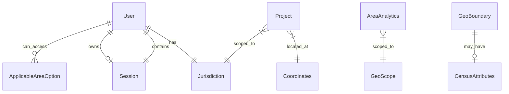

# Data Model: ProjectGeo

**Feature**: `002-geo-monitoring-platform`  
**Date**: 2026-05-23  
**Authority**: [`architecture.md`](../../architecture.md) §5.1, [spec.md](./spec.md) Key Entities

All entities and value objects are **class-based** in `src/app/domain/`. One public class per file; kebab-case filenames.

---

## Value Objects

### UserRole (`domain/value-objects/role.enum.ts`)

```typescript
enum UserRole {
  StateManager = 'state_manager',
  DistrictManager = 'district_manager',
  BlockManager = 'block_manager',
  Admin = 'admin',
}
```

**Source:** Mapped from GEOAPI `usp_group_code` (see `contracts/auth-api.md`).

---

### Coordinates (`domain/value-objects/coordinates.vo.ts`)

| Field | Type | Validation |
|-------|------|------------|
| latitude | `number` | -90..90, required |
| longitude | `number` | -180..180, required |

**Factory:** `Coordinates.create(lat, lng)` throws `DomainError` on null or out of range.

**Used by:** Project, map picker (US-05), marker placement (US-03).

---

### Jurisdiction (`domain/value-objects/jurisdiction.vo.ts`)

| Field | Type | Description |
|-------|------|-------------|
| states | `ReadonlyArray<string>` | Applicable state names |
| districts | `ReadonlyArray<string>` | Applicable districts (`'ALL'` for unrestricted within role) |
| blocks | `ReadonlyArray<string>` | Applicable blocks |
| role | `UserRole` | Drives scope rules |

**Methods:**
- `includesDistrict(district: string): boolean`
- `includesBlock(district: string, block: string): boolean`
- `isInside(other: Jurisdiction): boolean` — project containment check

**Rules (architecture §5.1.2):**
- StateManager / Admin: all districts/blocks within applicable states
- DistrictManager: own district(s); all or listed blocks
- BlockManager: own block(s) only

---

### Money (`domain/value-objects/money.vo.ts`)

| Field | Type | Validation |
|-------|------|------------|
| amount | `number` | ≥ 0 |
| currency | `string` | Default `INR` |

**Used by:** Project estimated/final cost.

---

### GeoScope (`domain/value-objects/geo-scope.vo.ts`)

| Field | Type | Description |
|-------|------|-------------|
| stateId | `number` | GEOAPI `tsm_state_id` |
| districtId | `number` | `tdm_district_id`; 0 = all |
| blockId | `number` | Block ID; 0 = all |

**Used by:** Repository queries for applicable areas and boundary loading.

---

## Entities

### User (`domain/entities/user.entity.ts`)

| Field | Type | Notes |
|-------|------|-------|
| id | `number` | Internal app ID (optional until backend provides) |
| userId | `string` | GEOAPI `usp_user_id` |
| name | `string` | Composed from first/middle/last |
| email | `string` | `usp_mailid` |
| role | `UserRole` | From `usp_group_code` |
| jurisdiction | `Jurisdiction` | Built from applicable-area services after login |
| permissions | `ReadonlyArray<string>` | e.g. `add_projects`, `edit_projects` |
| active | `boolean` | `usp_active_yn === 'Y'` |

**Methods:**
- `can(permission: string): boolean`
- `canAccessDistrict(districtName: string): boolean`
- `canAccessBlock(districtName: string, blockName: string): boolean`

**Stories:** US-01, US-02*, all scoped features.

---

### Session (`domain/entities/session.entity.ts`)

| Field | Type | Notes |
|-------|------|-------|
| token | `string` | JWT |
| user | `User` | Current user entity |
| expiresAt | `Date` | From JWT `exp` claim |

**Lifecycle:** Created on login (US-01); restored on refresh (US-01a); cleared on logout (US-01b).

---

### ApplicableAreaOption (`domain/entities/applicable-area.entity.ts`)

Discriminated by level — used for dropdown ViewModels.

**StateOption**

| Field | Type |
|-------|------|
| id | `number` (`tsm_state_id`) |
| name | `string` |

**DistrictOption**

| Field | Type |
|-------|------|
| id | `number` (`tdm_district_id`) |
| name | `string` |
| stateId | `number` |

**BlockOption**

| Field | Type |
|-------|------|
| id | `number` |
| name | `string` |
| districtId | `number` |
| stateId | `number` |

**Stories:** US-02c.

---

### Project (`domain/entities/project.entity.ts`)

| Field | Type | Required |
|-------|------|----------|
| id | `string` | Yes (after save) |
| projectName | `string` | Yes |
| activityName | `string` | Yes |
| schemeType | `string` | Yes |
| locationName | `string` | Yes |
| coordinates | `Coordinates` | Yes |
| jurisdiction | `Jurisdiction` | district + block names |
| estimatedCost | `Money \| null` | No |
| finalCost | `Money \| null` | No |
| fundType | `string` | Yes |
| beneficiaryName | `string` | Yes |
| beneficiaryDetails | `string` | No |
| aoiFileRef | `string \| null` | No (P2) |
| documentRefs | `ReadonlyArray<string>` | No (P2) |
| mediaRefs | `ReadonlyArray<string>` | No (P2) |

**Methods:**
- `isWithin(jurisdiction: Jurisdiction): boolean`
- `renameActivity(name: string): void` — throws if empty

**Validation:** `ProjectValidationService` aggregates required-field checks before save (US-05, FR-PROJ-07).

**Stories:** US-03, US-05, US-05a, US-05b.

---

### GeoBoundary (`domain/entities/geo-boundary.entity.ts`)

| Field | Type |
|-------|------|
| id | `string` |
| name | `string` |
| level | `'state' \| 'district' \| 'block'` |
| districtName | `string \| null` |
| stateName | `string \| null` |
| censusAttributes | `CensusAttributes \| null` |

**CensusAttributes** (block layer fallback):

| Field | Type | GeoJSON property |
|-------|------|------------------|
| totalPopulation | `number` | `TOT_P` |
| malePopulation | `number` | `TOT_M` |
| femalePopulation | `number` | `TOT_F` |
| scPopulation | `number` | `P_SC` |
| stPopulation | `number` | `P_ST` |
| households | `number` | `No_HH` |

**Stories:** US-03a, US-04a (fallback).

---

### AreaAnalytics (`domain/entities/area-analytics.entity.ts`)

| Field | Type |
|-------|------|
| scope | `GeoScope` |
| stateName | `string` |
| districtName | `string \| null` |
| blockName | `string \| null` |
| totalPopulation | `number` |
| genderDistribution | `GenderSlice[]` |
| casteDistribution | `CasteSlice[]` |
| waterReport | `WaterIndicators \| null` |
| soilReport | `SoilIndicators \| null` |

**GenderSlice:** `{ label: string; value: number }`  
**CasteSlice:** `{ label: string; value: number }`  
**WaterIndicators:** availability, quality, schemeCoverage (schema TBD — nullable)  
**SoilIndicators:** soilType, fertility, landUse (schema TBD — nullable)

**Stories:** US-04, US-04a, US-04b.

---

### SchemeCatalogEntry (`domain/entities/scheme-catalog.entity.ts`)

| Field | Type |
|-------|------|
| code | `string` |
| name | `string` |
| isCustom | `boolean` |

**Stories:** US-05 (FR-PROJ-10).

---

## Domain Services

### JurisdictionFilterService (`domain/services/jurisdiction-filter.service.ts`)

```typescript
filterProjects(projects: Project[], user: User): Project[]
filterByDistrict(projects: Project[], districtName: string): Project[]
filterByBlock(projects: Project[], districtName: string, blockName: string): Project[]
```

**Stories:** US-02, US-03, US-02a, US-02b.

---

### ProjectValidationService (`domain/services/project-validation.service.ts`)

Returns validation errors array for form steps; throws `DomainError` on invariant violation.

**Stories:** US-05, US-05a.

---

## Repository Ports (Abstract Classes)

| Port | Key methods | Implementation |
|------|-------------|----------------|
| `AuthRepository` | `login`, `getCurrentUser`, `logout` | `AuthApiRepository` |
| `ProjectRepository` | `getAllForUser`, `getById`, `create`, `update`, `delete` | `ProjectApiRepository` / `LocalProjectRepository` |
| `GeoRepository` | `loadDistricts`, `loadBlocks`, `resolveLocation` | `GeoJsonFileRepository` |
| `AnalyticsRepository` | `getSummary(scope)` | `AnalyticsApiRepository` + census fallback |
| `ApplicableAreaRepository` | `getStates`, `getDistricts`, `getBlocks` | HTTP jurisdiction repos |
| `SessionRepository` | `saveSession`, `loadSession`, `clearSession` | `SessionStorageRepository` |

**ISP split (optional, architecture §6.4):** `ProjectReader` / `ProjectWriter` for list-only use cases.

---

## Presentation View Models (not domain)

| ViewModel | Maps from | Purpose |
|-----------|-----------|---------|
| `ProjectViewModel` | `Project` | Formatted costs, labels |
| `HomeViewModel` | Projects + filters | Sidebar cards |
| `MapViewModel` | Selection + markers | Map state |
| `AreaSummaryViewModel` | `AreaAnalytics` | Chart inputs |
| `LoginViewModel` | Form state | User ID field label |

---

## Entity Relationships



---

## State Transitions

### Session

```text
Anonymous → LoginSuccess → Authenticated
Authenticated → Refresh → Authenticated (token valid)
Authenticated → TokenExpired → Anonymous (redirect login)
Authenticated → Logout → Anonymous
```

### Project (US-05 journey)

```text
Draft (form step 1–4) → Validated → Saved → VisibleOnMap
Saved → EditMode → Validated → Updated
```

---

## Validation Summary

| Entity | Rule | Error |
|--------|------|-------|
| User | inactive cannot login | ApplicationError `ACCOUNT_INACTIVE` |
| Coordinates | lat/lng in range | DomainError |
| Project | required fields on submit | ApplicationError `VALIDATION_FAILED` |
| Project | block manager outside block | ApplicationError `UNAUTHORIZED` |
| Jurisdiction | template must not filter alone | Use case + domain service |
