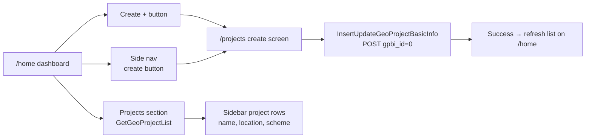

# ProjectGeo — User Stories

**Document Version:** 1.1  
**Created:** 2026-05-23  
**Updated:** 2026-06-13  
**Status:** Draft  
**Source:** [`requirement.md`](./requirement.md)  
**Related:** [`api.md`](./api.md) · [`architecture.md`](./architecture.md)

---

## 1. Purpose

This document translates product requirements into **prioritized, testable user stories** for the ProjectGeo revamp. Each story is independently deliverable where possible and maps to functional requirements (FR-*), API endpoints, and implementation phases.

**Story format:**

```
As a [role]
I want to [action]
So that [business value]
```

**Priority legend:**

| Priority | Meaning |
|----------|---------|
| **P1** | MVP — must ship in first release |
| **P2** | Important — second wave |
| **P3** | Nice to have — defer if schedule tight |

---

## 2. Epics Overview

| Epic ID | Epic Name | Phase | Stories |
|---------|-----------|-------|---------|
| E-01 | Authentication & Session | Phase 1 | US-01, US-01a, US-01b |
| E-02 | Jurisdiction & Dashboard Filters | Phase 1 | US-02, US-02a, US-02b, US-02c |
| E-03 | Map & Geo Visualization | Phase 1 | US-03, US-03a, US-03b, US-03c, US-03d |
| E-04 | Area Analytics & Reports | Phase 2 | US-04, US-04a, US-04b |
| E-05 | Project Management | Phase 2–3 | US-05, US-05a, US-05b, US-05c, US-05d, US-05e, US-05f |
| E-06 | API Integration & Platform | Phase 1–4 | US-06, US-06a, US-06b |
| E-07 | Navigation, UI & Accessibility | Phase 3 | US-07, US-07a, US-07b |

---

## 3. Story Backlog (Summary)

| ID | Title | Role | Priority | Epic | FR Ref |
|----|-------|------|----------|------|--------|
| US-01 | Secure login with government credentials | All users | P1 | E-01 | FR-AUTH-01–06 |
| US-01a | Session restore after page refresh | All users | P1 | E-01 | FR-AUTH-02 |
| US-01b | Logout and clear session | All users | P1 | E-01 | FR-AUTH-05 |
| US-02 | State-wide project overview | State Manager | P1 | E-02 | FR-DASH-01–04 |
| US-02a | District-scoped dashboard | District Manager | P1 | E-02 | FR-DASH-02–04 |
| US-02b | Block-scoped dashboard | Block Manager | P1 | E-02 | FR-DASH-02–04 |
| US-02c | Cascading state/district/block filters | All users | P1 | E-02 | FR-DASH-03–04 |
| US-03 | Interactive map with project pins | All users | P1 | E-03 | FR-MAP-01, 05–08 |
| US-03a | District & block boundary layers | All users | P1 | E-03 | FR-MAP-02–04, 10 |
| US-03b | Project detail panel on pin click | All users | P1 | E-03 | FR-MAP-06 |
| US-03c | Map layer switcher | All users | P2 | E-03 | FR-DASH-09 |
| US-03d | Scheme type icons & map quick filter | All users | P1 | E-03 | FR-MAP-05, FR-DASH-06 |
| US-04 | Area summary on geographic click | All users | P1 | E-04 | FR-ANLY-01–08 |
| US-04a | Gender & caste charts | All users | P1 | E-04 | FR-ANLY-02–03 |
| US-04b | Water & soil reports | All users | P1 | E-04 | FR-ANLY-04–05 |
| US-05 | Create new project | District / Block Manager | P1 | E-05 | FR-PROJ-01–03, 07–08 |
| US-05a | Edit existing project | District / Block Manager | P1 | E-05 | FR-PROJ-06–08 |
| US-05b | Upload project documents & media | District / Block Manager | P2 | E-05 | FR-PROJ-04–05 |
| US-05c | Search and browse project list | All users | P2 | E-05 | FR-DASH-05–07 |
| US-05d | Dashboard project list from API | All users | P1 | E-05 | FR-DASH-05, FR-DASH-07 |
| US-05e | Project create entry points (dashboard & side nav) | District / Block Manager | P1 | E-05 | FR-PROJ-01, FR-NAV-01 |
| US-05f | Submit project basic info via GEOAPI | District / Block Manager | P1 | E-05 | FR-PROJ-02–03, FR-API-01 |
| US-06 | API-backed production data | System / Dev team | P1 | E-06 | FR-API-01–04 |
| US-06a | Graceful API errors & loading states | All users | P2 | E-06 | FR-API-05–06 |
| US-06b | IIS production deployment | DevOps | P2 | E-06 | NFR-07 |
| US-07 | Figma-aligned UI | All users | P1 | E-07 | FR-NAV-03 |
| US-07a | App navigation & header | All users | P2 | E-07 | FR-NAV-01–02 |
| US-07b | Responsive desktop/tablet layout | All users | P2 | E-07 | FR-NAV-04 |

---

## 4. Detailed User Stories

---

### Epic E-01 — Authentication & Session

#### US-01 — Secure Login with Government Credentials (P1)

**As a** government official  
**I want to** log in with my User ID and password  
**So that** I can access ProjectGeo securely within my assigned role

**Why this priority:** No other feature works without authenticated, role-scoped access.

**Independent delivery:** Login screen calls GEOAPI, stores JWT, redirects to Home — demonstrable without map or projects.

**Applies to:** State Manager, District Manager, Block Manager, Admin

**API:** `POST /UserDetails/ValidateUserLogin` ([`api.md`](./api.md) §3.1)

**Maps to:** FR-AUTH-01, FR-AUTH-03, FR-AUTH-06

**Acceptance scenarios:**

1. **Given** I am on `/login` with valid `user_id`, password, and auto-generated `device_uuid`, **When** I submit the form, **Then** the system calls ValidateUserLogin, receives `success: true` and a JWT, stores the token, maps `usp_group_code` to my role, and navigates to `/home`.

2. **Given** I enter an invalid password, **When** I submit, **Then** the API returns `success: false`, I remain on login, and I see the message *"Login failed! Invalid user or password!"* without exposing whether the user ID exists.

3. **Given** my account has `usp_active_yn !== 'Y'`, **When** I attempt login, **Then** access is denied with a clear inactive-account message.

4. **Given** I am not logged in, **When** I navigate to `/home` or `/projects`, **Then** I am redirected to `/login`.

5. **Given** a successful login as District Manager, **When** I reach the dashboard, **Then** I only see data within my applicable districts (no cross-district leakage).

6. **Given** a successful login as Block Manager, **When** I reach the dashboard, **Then** I only see data within my applicable blocks.

**Notes:**
- Login uses **`user_id`** (e.g. `STMN001`), not email — UI label must reflect this.
- Do not persist `usp_pswd` from the API response.
- Role derived from `usp_group_code` (e.g. `SM` → State Manager).

---

#### US-01a — Session Restore After Page Refresh (P1)

**As a** logged-in user  
**I want to** remain authenticated after refreshing the browser  
**So that** I do not have to log in repeatedly during my work session

**Maps to:** FR-AUTH-02

**Acceptance scenarios:**

1. **Given** I logged in successfully and refreshed the page, **When** the app loads, **Then** my session is restored from storage and I remain on the current route (or `/home` if on a protected route).

2. **Given** my JWT is expired, **When** I refresh or make an API call, **Then** I am redirected to login with an session-expired message.

---

#### US-01b — Logout and Clear Session (P1)

**As a** logged-in user  
**I want to** log out from the header menu  
**So that** my session is cleared on shared government computers

**Maps to:** FR-AUTH-05

**Acceptance scenarios:**

1. **Given** I am logged in, **When** I click Logout, **Then** token and user profile are cleared, jurisdiction cache is reset, and I am redirected to `/login`.

2. **Given** I logged out, **When** I use the browser back button, **Then** I cannot access protected routes without logging in again.

---

### Epic E-02 — Jurisdiction & Dashboard Filters

#### US-02 — State-Wide Project Overview (P1)

**As a** State Manager  
**I want to** see all running project types in my state and filter by any district  
**So that** I can monitor statewide scheme progress from one dashboard

**Why this priority:** Core value proposition for the highest-level government user.

**Maps to:** FR-DASH-01, FR-DASH-02, FR-DASH-04, FR-DASH-06

**Acceptance scenarios:**

1. **Given** I am a State Manager on `/home`, **When** the dashboard loads, **Then** I see the full state map, project sidebar, and all districts I am applicable for in the district dropdown.

2. **Given** projects exist in multiple districts, **When** I have no district selected, **Then** the sidebar shows all in-scope projects for my state and the project count badge reflects the total.

3. **Given** I select district **CHANGLANG**, **When** the selection applies, **Then** the project list filters to that district, the map zooms/highlights the district, and only relevant project pins remain visible.

4. **Given** I am a State Manager, **When** I open the district dropdown, **Then** every district returned by `GetUserApplicableDistrict` is selectable (not locked to a single district).

**API (filters):** `GetUserApplicableState`, `GetUserApplicableDistrict`, `GetUserApplicableBlock`

---

#### US-02a — District-Scoped Dashboard (P1)

**As a** District Manager  
**I want to** land on a dashboard scoped to my assigned district  
**So that** I immediately see relevant projects without navigating other districts

**Maps to:** FR-DASH-02, FR-DASH-04, FR-MAP-08

**Acceptance scenarios:**

1. **Given** I am a District Manager with one applicable district, **When** I log in, **Then** the map auto-zooms to my district and the district dropdown is pre-selected.

2. **Given** I am a District Manager, **When** I view the district dropdown, **Then** I only see districts returned by the API for my user — not the full state list.

3. **Given** I am a District Manager, **When** I attempt to view another district's projects (via API tampering or URL), **Then** the backend returns no unauthorized data.

---

#### US-02b — Block-Scoped Dashboard (P1)

**As a** Block Manager  
**I want to** land on a dashboard scoped to my assigned block  
**So that** I focus only on work in my administrative block

**Maps to:** FR-DASH-02, FR-DASH-04, FR-MAP-08

**Acceptance scenarios:**

1. **Given** I am a Block Manager, **When** I log in, **Then** the map auto-zooms to my block and both district and block dropdowns reflect my jurisdiction.

2. **Given** I am a Block Manager, **When** I view the project sidebar, **Then** only projects within my applicable block(s) are listed.

3. **Given** I am a Block Manager, **When** I open the block dropdown, **Then** I only see blocks from `GetUserApplicableBlock` for my user, state, and district.

---

#### US-02c — Cascading State / District / Block Filters (P1)

**As a** authorized user  
**I want to** use linked state, district, and block dropdowns on the dashboard  
**So that** I can drill down geographically in a predictable order

**Maps to:** FR-DASH-03, FR-DASH-04

**API:** See [`api.md`](./api.md) §4–§5

**Acceptance scenarios:**

1. **Given** I am logged in, **When** the home page loads, **Then** the state dropdown is populated from `GetUserApplicableState(userId, stateId=0)`.

2. **Given** I select state **ARUNACHAL PRADESH** (`tsm_state_id: 12`), **When** the district list loads, **Then** `GetUserApplicableDistrict(userId, stateId=12, districtId=0)` populates the district dropdown.

3. **Given** I select district **CHANGLANG** (`tdm_district_id: 12`), **When** the block list loads, **Then** `GetUserApplicableBlock(userId, stateId=12, districtId=12, blockId=0)` populates the block dropdown.

4. **Given** the API returns an empty district or block array with HTTP 200, **When** the response is `"No Records found!"`, **Then** the dropdown shows empty state gracefully (no crash, disabled child dropdown).

5. **Given** I change the district selection, **When** the new district is applied, **Then** the block dropdown resets and reloads for the new district.

6. **Given** I select a district or block in the dropdown, **When** the map is visible, **Then** map highlight and viewport sync with the selection (bidirectional).

---

### Epic E-03 — Map & Geo Visualization

#### US-03 — Interactive Map with Project Pins (P1)

**As an** authorized user  
**I want to** see project pins on a Leaflet map and click them for details  
**So that** I understand where development work is happening in my jurisdiction

**Maps to:** FR-MAP-01, FR-MAP-05, FR-MAP-07, FR-MAP-08, FR-DASH-07

**Acceptance scenarios:**

1. **Given** I am on `/home`, **When** the map loads, **Then** an interactive Leaflet map renders with project markers at lat/long coordinates within my scope.

2. **Given** project markers are visible, **When** I hover a pin, **Then** a tooltip shows project name and location (if available).

3. **Given** I click a project pin, **When** the detail panel opens, **Then** I see project information without losing my current district/block map selection.

4. **Given** I select a project from the sidebar, **When** the selection is applied, **Then** the map centers on that pin and opens the detail panel.

5. **Given** I am a Block Manager, **When** the map renders, **Then** only pins for my block are shown — not statewide pins.

---

#### US-03a — District & Block Boundary Layers (P1)

**As an** authorized user  
**I want to** see state, district, and block boundaries on the map  
**So that** I can understand administrative geography alongside projects

**Maps to:** FR-MAP-02, FR-MAP-03, FR-MAP-04, FR-MAP-10

**Acceptance scenarios:**

1. **Given** the map is loaded, **When** I view the state/district level, **Then** district GeoJSON boundaries render on the map.

2. **Given** I click a district boundary, **When** the district is selected, **Then** it highlights, the map zooms to bounds, child block layers load, and the district summary flow begins.

3. **Given** I click a block boundary, **When** the block is selected, **Then** it highlights and block-level summary flow begins.

4. **Given** API district names are uppercase (e.g. `CHANGLANG`) and GeoJSON uses mixed case, **When** matching boundaries to dropdown values, **Then** comparison is case-insensitive.

5. **Given** block layer uses `ARUNACHAL_PRADESH_BLOCK.geojson`, **When** a block is selected, **Then** census attributes (e.g. `TOT_P`, `TOT_M`, `TOT_F`) are available for analytics fallback.

---

#### US-03b — Project Detail Panel on Pin Click (P1)

**As an** authorized user  
**I want to** open a tabbed detail panel when I click a project pin  
**So that** I can review project info, beneficiaries, documents, and media in one place

**Maps to:** FR-MAP-06, FR-PROJ-09

**Acceptance scenarios:**

1. **Given** I click a project pin, **When** the panel opens, **Then** I see tabs: **Info**, **Beneficiaries Details**, **Documentation**, **Photo & Videography**.

2. **Given** the Info tab is active, **When** data is loaded, **Then** I see project name, scheme type, location, coordinates, costs, fund type, district, and block.

3. **Given** the panel is open, **When** I click "View Project Details", **Then** I can open the full project page (`/projects`) in a new tab.

4. **Given** the panel is open, **When** I close it, **Then** the map and filters remain unchanged.

---

#### US-03c — Map Base Layer Switcher (P2)

**As an** authorized user  
**I want to** switch map base layers (Satellite, Streets, Hybrid, etc.)  
**So that** I can view geography in the most useful context

**Maps to:** FR-DASH-09

**Acceptance scenarios:**

1. **Given** I am on the dashboard map, **When** I select **Satellite**, **Then** the basemap switches without clearing project pins or boundary layers.

2. **Given** I switch layers, **When** the new layer loads, **Then** the current zoom and center are preserved.

---

#### US-03d — Scheme Type Icons & Map Quick Filter (P1)

**As an** authorized user  
**I want to** filter projects by scheme type using icon chips on the dashboard map and see matching icons on map pins  
**So that** I can quickly identify and focus on the project types relevant to my monitoring work

**Applies to:** All roles (filtered pins respect jurisdiction scope)

**Why this priority:** Scheme-type visual identification is core to statewide scheme monitoring; officials need at-a-glance differentiation on the map and in the sidebar without reading every label.

**Independent Delivery:** Map toolbar shows scheme-type icon filters; pins and sidebar list use the same icon/color per type; selecting a type filters visible pins and sidebar projects.

**Maps to:** FR-MAP-05, FR-MAP-09 (partial), FR-DASH-06 (partial), FR-PROJ-10 (catalog alignment)

**Shared catalog:** All screens MUST use the canonical scheme-type catalog at `src/app/domain/catalog/scheme-type.catalog.ts` (labels, Material Icons, colors). Project form (`insert-update-project`) dropdown values MUST match catalog labels.

**Scheme type catalog (authoritative labels):**

| Scheme Type | Material Icon | Color | Use |
|-------------|---------------|-------|-----|
| Construction / Civil Work | `construction` | `#004ac6` | Filter chip + map pin |
| Plantation | `park` | `#2e7d32` | Filter chip + map pin |
| Production System | `precision_manufacturing` | `#6a1b9a` | Filter chip + map pin |
| Water Supply | `water_drop` | `#515f74` | Filter chip + map pin |
| Sewage / Drainage System | `plumbing` | `#00838f` | Filter chip + map pin |
| Waste Management | `recycling` | `#558b2f` | Filter chip + map pin |
| Financial Assistance / Loan | `account_balance` | `#1565c0` | Filter chip + map pin |
| Transport & Infrastructure | `directions_car` | `#455a64` | Filter chip + map pin |
| Skills & Workforce Development | `school` | `#f57c00` | Filter chip + map pin |
| Surface Mining | `landscape` | `#795548` | Filter chip + map pin |
| Misc. (Create new) | `category` | `#757575` | Default for custom/unknown types |

**Acceptance scenarios:**

1. **Given** I am on `/home`, **When** the map loads, **Then** I see a scheme-type quick-filter bar (icon chips with labels or tooltips) for all catalog types plus an **All** option.

2. **Given** project pins are visible, **When** I view a pin, **Then** its marker icon and color match the scheme type's catalog entry (same icon as sidebar project list).

3. **Given** I tap a scheme-type filter chip (e.g. **Water Supply**), **When** the filter applies, **Then** only pins and sidebar projects of that type remain visible within my jurisdiction scope.

4. **Given** a scheme-type filter is active, **When** I select **All** or clear the filter, **Then** all in-scope projects reappear on the map and sidebar.

5. **Given** a project has a custom scheme type not in the catalog, **When** it renders, **Then** it uses the **Misc.** icon and color fallback without breaking the map.

6. **Given** I combine scheme-type filter with district/block dropdown filters, **When** both are active, **Then** results reflect the intersection of geographic and scheme-type scope.

7. **Given** I hover a map pin, **When** the tooltip opens, **Then** it shows project name, location, and scheme type label.

**Journey continuation:** Login → home dashboard → filter by **Transport & Infrastructure** → map shows only road/bridge pins with car icon → click pin for project detail (US-03b).

**Implementation notes:**

- Replace ad-hoc `getSchemeIcon()` / `getSchemeColor()` helpers with `resolveSchemeType()` from the shared catalog.
- `LeafletMapAdapter` pin rendering MUST use catalog `materialIcon` + `color` (Material icon rendered inside divIcon or equivalent).
- Quick-filter UI placement: map workspace toolbar (alongside or below base layer switcher) or top filter row — must not obscure map controls.

---

### Epic E-04 — Area Analytics & Reports

#### US-04 — Area Summary on Geographic Click (P1)

**As an** authorized user  
**I want to** click a district, block, or map area and see a summary analytics panel  
**So that** I understand local demographics and resource conditions before planning work

**Maps to:** FR-ANLY-01, FR-ANLY-07, FR-ANLY-08, FR-ANLY-10

**Acceptance scenarios:**

1. **Given** I click a district or block on the map, **When** the summary panel opens, **Then** it shows state name, district name, and block name (when applicable) plus total population.

2. **Given** the summary panel is open, **When** I click close, **Then** the panel dismisses and map state is preserved.

3. **Given** I selected a block, **When** summary loads, **Then** all metrics scope to that block only — not statewide aggregates.

---

#### US-04a — Gender & Caste Distribution Charts (P1)

**As an** authorized user  
**I want to** see male/female comparison and caste/community charts for a selected area  
**So that** I can understand population composition for scheme planning

**Maps to:** FR-ANLY-02, FR-ANLY-03, FR-ANLY-06, FR-ANLY-09

**Acceptance scenarios:**

1. **Given** I open the area summary for a district, **When** charts render, **Then** I see a **Gender Distribution** chart (male vs female vs others if applicable).

2. **Given** I open the area summary, **When** charts render, **Then** I see a **Caste / Community Distribution** chart with legend.

3. **Given** analytics API is unavailable, **When** census data exists in block GeoJSON, **Then** gender/caste charts MAY fall back to `TOT_M`, `TOT_F`, `P_SC`, `P_ST` fields.

4. **Given** charts are displayed, **When** I view them, **Then** all values are graphical (pie, donut, or bar) — not raw tables only.

---

#### US-04b — Water & Soil Reports (P1)

**As an** authorized user  
**I want to** see water and soil reports for a selected area in graphical form  
**So that** I can assess resource conditions for irrigation, PHED, and agriculture schemes

**Maps to:** FR-ANLY-04, FR-ANLY-05, FR-ANLY-06

**Acceptance scenarios:**

1. **Given** I open the area summary, **When** water data is available, **Then** I see a **Water Report** section with chart(s) and key indicators (availability, quality, scheme coverage as defined by API).

2. **Given** I open the area summary, **When** soil data is available, **Then** I see a **Soil Report** section with chart(s) for soil type, fertility, or land use.

3. **Given** water or soil API returns empty data, **When** the panel renders, **Then** I see a clear empty state — not broken charts or errors.

> **Dependency:** Water/soil API schemas pending ([`requirement.md`](./requirement.md) Q-02, Q-03).

---

### Epic E-05 — Project Management

**Project create & list journey (v1 — API-backed):**



| Step | User action | Story | API |
|------|-------------|-------|-----|
| 1 | View project list on dashboard | **US-05d** | `GetGeoProjectList` |
| 2a | Tap **Create +** under Projects heading | **US-05e** | — |
| 2b | Tap create button in side nav rail | **US-05e** | — |
| 3 | Fill existing form fields & submit | **US-05f** | `InsertUpdateGeoProjectBasicInfo` |
| 4 | See new project in dashboard list | **US-05d** | `GetGeoProjectList` |

---

#### US-05 — Create New Project (P1)

**As a** District Manager or Block Manager  
**I want to** create a new project using a multi-step form with map-based location  
**So that** the project appears on dashboards and maps in my jurisdiction

**Maps to:** FR-PROJ-01, FR-PROJ-02, FR-PROJ-03, FR-PROJ-07, FR-PROJ-08, FR-PROJ-10

**Acceptance scenarios:**

1. **Given** I have create permission, **When** I open `/projects`, **Then** I see the 5-step project application form (Activity & Location → Beneficiary → Documents → Media → Review).

2. **Given** I am on Step 1, **When** I pick a location on the map or enter lat/long, **Then** coordinates and district/block fields populate where possible.

3. **Given** I leave required fields empty, **When** I attempt to submit, **Then** validation prevents submission with field-level errors.

4. **Given** I complete and submit a valid form, **When** save succeeds, **Then** the project appears in the sidebar and as a map pin within my jurisdiction.

5. **Given** I am a Block Manager, **When** I create a project outside my block, **Then** submission is rejected by validation or API.

> **Note:** Basic project create/list flows are covered by **US-05d**, **US-05e**, and **US-05f** using GEOAPI endpoints documented in [`api.md`](./api.md) §6. Multi-step beneficiary, document, and media steps remain covered by **US-05** / **US-05b** until upload APIs are available.

---

#### US-05a — Edit Existing Project (P1)

**As a** District Manager or Block Manager  
**I want to** edit projects within my jurisdiction  
**So that** I can update costs, beneficiary details, and location when circumstances change

**Maps to:** FR-PROJ-06, FR-PROJ-07, FR-PROJ-08

**Acceptance scenarios:**

1. **Given** I open an in-scope project on `/projects`, **When** I edit fields and save, **Then** changes persist via API and reflect on map and sidebar immediately.

2. **Given** I am a District Manager, **When** I attempt to edit a project outside my district, **Then** the action is denied.

3. **Given** I am in edit mode, **When** the form loads, **Then** existing project data pre-fills all steps.

---

#### US-05b — Upload Project Documents & Media (P2)

**As a** District Manager or Block Manager  
**I want to** upload AOI files, beneficiary documents, plans, and photos/videos  
**So that** complete project records are stored centrally

**Maps to:** FR-PROJ-04, FR-PROJ-05

**Acceptance scenarios:**

1. **Given** I am on the project form, **When** I upload an AOI GeoJSON/file, **Then** it attaches to the project record.

2. **Given** I upload documents and media, **When** I view the project detail panel Documentation and Photo/Video tabs, **Then** uploaded files are listed or previewed.

3. **Given** I upload an unsupported file type or oversized file, **When** validation runs, **Then** I see a clear error before upload proceeds.

---

#### US-05c — Search and Browse Project List (P2)

**As an** authorized user  
**I want to** search the project sidebar by name, location, scheme, or beneficiary  
**So that** I can quickly find a specific project among many

**Maps to:** FR-DASH-05, FR-DASH-07

**Acceptance scenarios:**

1. **Given** multiple projects are listed, **When** I type in the search box, **Then** the list filters in under 1 second (client-side) matching activity name, location, scheme type, or beneficiary.

2. **Given** search returns no matches, **When** the list is empty, **Then** I see a friendly "no projects found" message.

> **Prerequisite:** Project list data is loaded via **US-05d** (`GetGeoProjectList`).

---

#### US-05d — Dashboard Project List from API (P1)

**As an** authorized user  
**I want to** see my applicable projects in the dashboard sidebar loaded from the GEOAPI  
**So that** the project list reflects real, up-to-date records for my login scope

**Maps to:** FR-DASH-05, FR-DASH-07, FR-API-01

**API:** `GET /UserDetails/GetGeoProjectList` — see [`api.md`](./api.md) §6.2

**Query parameters:**

| Parameter | Value |
|-----------|-------|
| `loginUserId` | Logged-in `usp_user_id` |
| `currentPageNo` | `1` (initial load; extend for pagination later) |
| `noOfPagesToGet` | Page size (e.g. `50`) |
| `activeYn` | `Y` for active projects |

**Acceptance scenarios:**

1. **Given** I am logged in on `/home`, **When** the dashboard loads, **Then** the app calls `GetGeoProjectList` with my `loginUserId` and renders results in the **Projects** sidebar section.

2. **Given** the API returns `geoProjectList` with records, **When** the list renders, **Then** each row shows at minimum:
   - Project name → `gpbi_project_name`
   - Location → `gpbi_location_name`
   - Scheme / type labels → `gpbi_project_scheme_type_name`, `gpbi_project_type_name`
   - Project code → `gpbi_project_code` (when shown in UI)

3. **Given** I change dashboard filters (state, district, block, project type, status), **When** filters apply, **Then** the sidebar list reflects only in-scope projects (client-side filter on API results or refetch per integration design).

4. **Given** the API returns an empty `geoProjectList` with `success: true`, **When** the sidebar renders, **Then** I see a friendly empty state (e.g. "No projects match your filters.") — not an error.

5. **Given** the API call fails or times out, **When** the sidebar cannot load, **Then** I see a clear error or retry state per **US-06a** — not a silent empty list.

6. **Given** I select a project in the sidebar, **When** the item is highlighted, **Then** the map pin for that project is emphasized (when coordinates are available from `gpbi_geo_location_lat` / `gpbi_geo_location_long`).

---

#### US-05e — Project Create Entry Points (Dashboard & Side Nav) (P1)

**As a** District Manager or Block Manager  
**I want to** start a new project from obvious entry points on the dashboard and side navigation  
**So that** I can create a project without manually typing a URL

**Maps to:** FR-PROJ-01, FR-NAV-01

**Acceptance scenarios:**

1. **Given** I am on `/home`, **When** I view the **Projects** section header in the dashboard sidebar, **Then** I see the **Projects** heading with a **Create +** control styled as an underlined text/link button beside or below the heading (alongside the existing filter icon).

2. **Given** I have create permission, **When** I click **Create +** in the Projects section, **Then** I am navigated to the project create screen (`/projects`) in **create mode** (`gpbi_id = 0`).

3. **Given** I am on `/home`, **When** I view the left **side nav rail**, **Then** I see a dedicated **project create** button (e.g. add / create-project icon) that is visually distinct from map, layers, and analytics actions.

4. **Given** I click the side nav **project create** button, **When** navigation completes, **Then** I land on the same project create screen (`/projects`) in create mode — same destination as the dashboard **Create +** control.

5. **Given** I do not have create permission (role TBD with backend), **When** the dashboard or side nav renders, **Then** create entry points are hidden or disabled with no navigation to create mode.

6. **Given** I opened create from either entry point, **When** the create screen loads, **Then** jurisdiction context from the dashboard (selected state / district / block) pre-fills matching form dropdowns where applicable.

---

#### US-05f — Submit Project Basic Info via GEOAPI (P1)

**As a** District Manager or Block Manager  
**I want to** submit the project create form using the GEOAPI project basic-info endpoint  
**So that** new projects are saved centrally and appear in the dashboard list after creation

**Maps to:** FR-PROJ-02, FR-PROJ-03, FR-PROJ-07, FR-PROJ-08, FR-API-01

**API:** `POST /UserDetails/InsertUpdateGeoProjectBasicInfo` — see [`api.md`](./api.md) §6.1

**Acceptance scenarios:**

1. **Given** I am on the project create screen (`/projects`) with `gpbi_id = 0`, **When** I complete required fields and submit, **Then** the app sends `POST InsertUpdateGeoProjectBasicInfo` with a JSON body matching the API contract.

2. **Given** the API responds with `{ "success": true, "message": "Data submitted successfully." }`, **When** submit completes, **Then** I see a success confirmation and am returned to `/home` (or the project list refreshes) so the new project appears via **US-05d**.

3. **Given** required fields are missing or invalid, **When** I attempt submit, **Then** client-side validation blocks the API call and shows field-level errors on the existing form.

4. **Given** the API returns `success: false` or a validation message, **When** submit fails, **Then** the API `message` is shown to the user and form data is preserved.

5. **Given** I am editing an existing project (`gpbi_id > 0`), **When** I save, **Then** the same endpoint is called with the existing `gpbi_id` (covered in detail by **US-05a**).

**Form field mapping (create screen → API):**

The project create screen keeps its **existing input fields and layout** (activity, location, map coordinates, scheme type, jurisdiction, contact, dates, etc.). On submit, values map to the API DTO as follows:

| UI / form concept | API field | Notes |
|-------------------|-----------|-------|
| New project | `gpbi_id` | `0` on create |
| Project type dropdown | `gpbi_project_type` | Code e.g. `GPT_02` |
| Project / activity name | `gpbi_project_name` | |
| Scheme type dropdown | `gpbi_project_scheme_type` | Code e.g. `GPS_01` |
| State dropdown | `gpbi_state_id` | From `GetUserApplicableState` |
| District dropdown | `gpbi_district_id` | From `GetUserApplicableDistrict` |
| Block dropdown | `gpbi_block_id` | From `GetUserApplicableBlock` |
| Location / village | `gpbi_location_name` | |
| Nearest landmark | `gpbi_nearest_landmark` | |
| Map pick / geo type | `gpbi_geo_location_type` | e.g. `POINT` |
| Latitude | `gpbi_geo_location_lat` | String in API |
| Longitude | `gpbi_geo_location_long` | String in API |
| GPS accuracy | `gpbi_geo_location_accuracy` | |
| Length / area / volume | `gpbi_geo_location_length_area_vol` | `0` for point locations |
| Assigned engineer / user | `gpbi_project_assigned_to` | User ID e.g. `STEN001` |
| Contact name | `gpbi_contact_name` | |
| Contact phone | `gpbi_contact_number` | |
| Contact email | `gpbi_contact_email_id` | |
| Status | `gpbi_project_status` | e.g. `PENDING` on create |
| Logged-in user | `gpbi_login_user` | `usp_user_id` |
| Active flag | `gpbi_active` | `Y` |
| Planned / actual dates | `gpbi_planned_start_date`, `gpbi_actual_start_date`, `gpbi_planned_end_date`, `gpbi_actual_end_date` | `YYYY-MM-DD` |

> **Out of scope for US-05f:** Beneficiary details, document uploads, and media uploads (steps 2–4 of the multi-step form) remain local or deferred until file/upload APIs exist (**US-05b**). Only **basic info** is persisted via this endpoint in v1.

---

### Epic E-06 — API Integration & Platform

#### US-06 — API-Backed Production Data (P1)

**As a** system operator  
**I want** all auth, jurisdiction, project, and analytics data served via REST APIs  
**So that** the application is multi-user safe and production-ready

**Maps to:** FR-API-01, FR-API-02, FR-API-03, FR-API-04

**Acceptance scenarios:**

1. **Given** production mode, **When** any feature loads data, **Then** it uses HTTP repositories — not `localStorage` dummy datasets.

2. **Given** [`api.md`](./api.md) is published, **When** a developer integrates a feature, **Then** endpoint contracts, DTOs, and cURL examples are available.

3. **Given** I am logged in, **When** the app calls protected APIs, **Then** the JWT is sent as `Authorization: Bearer <token>`.

4. **Given** role-based filtering, **When** the backend returns data, **Then** unauthorized records are never returned regardless of frontend manipulation.

**Current API status:**

| Domain | Status |
|--------|--------|
| Login | ✅ Available |
| State / District / Block dropdowns | ✅ Available |
| Project list (`GetGeoProjectList`) | ✅ Available |
| Project submit / update basic info (`InsertUpdateGeoProjectBasicInfo`) | ✅ Available |
| Project delete | ⏳ Pending |
| Analytics | ⏳ Pending |
| File upload | ⏳ Pending |

---

#### US-06a — Graceful API Errors & Loading States (P2)

**As a** user on a government network  
**I want** clear loading indicators and error messages when APIs fail  
**So that** I know whether to retry or contact support

**Maps to:** FR-API-05, FR-API-06

**Acceptance scenarios:**

1. **Given** an API call is in progress, **When** I wait for data, **Then** I see a loading indicator on the affected UI section.

2. **Given** the network is unavailable, **When** a request fails, **Then** I see a user-friendly message — not a raw HTTP error.

3. **Given** login returns `success: false`, **When** the response is displayed, **Then** the API `message` field is shown to the user.

---

#### US-06b — IIS Production Deployment (P2)

**As a** DevOps engineer  
**I want** the Angular build deployed on IIS with SPA routing  
**So that** users can access ProjectGeo via the government web server

**Maps to:** NFR-07

**Acceptance scenarios:**

1. **Given** production build output in `dist/ProjectGeo/browser`, **When** deployed with `web.config`, **Then** deep links (`/home`, `/projects`) resolve without 404.

2. **Given** HTTPS is configured on IIS, **When** users access the app, **Then** all API calls use HTTPS.

---

### Epic E-07 — Navigation, UI & Accessibility

#### US-07 — Figma-Aligned UI (P1)

**As a** government user  
**I want** the application to match approved Figma designs  
**So that** the interface is consistent, professional, and easy to use

**Maps to:** FR-NAV-03

**Acceptance scenarios:**

1. **Given** Figma designs for login, dashboard, map panels, and project form, **When** implemented screens are reviewed, **Then** layout, typography, colors, and component spacing match ≥ 90% (per SC-07).

2. **Given** existing brand elements, **When** UI is updated, **Then** Orbitron "Project Geo" branding and navbar gradient are preserved unless Figma specifies otherwise.

---

#### US-07a — App Navigation & Header (P2)

**As a** logged-in user  
**I want** consistent header navigation between Home and Projects  
**So that** I can move between monitoring and project management easily

**Maps to:** FR-NAV-01, FR-NAV-02

**Acceptance scenarios:**

1. **Given** I am logged in, **When** I view the header, **Then** I see links to Home and Projects plus my user name and logout.

2. **Given** I toggle theme in the user menu, **When** dark/light mode switches, **Then** the preference applies across pages.

---

#### US-07b — Responsive Desktop & Tablet Layout (P2)

**As a** user on a tablet or laptop  
**I want** the dashboard and forms to remain usable at common screen sizes  
**So that** I can work in field offices without a large monitor

**Maps to:** FR-NAV-04, NFR-05

**Acceptance scenarios:**

1. **Given** viewport width ≥ 768px, **When** I use the dashboard, **Then** map and sidebar layout adapts without horizontal scroll breakage.

2. **Given** form fields on `/projects`, **When** viewed on tablet, **Then** labels, inputs, and stepper remain readable and tappable.

---

## 5. Role × Story Matrix

| Story | State Mgr | District Mgr | Block Mgr | Admin |
|-------|:---------:|:------------:|:---------:|:-----:|
| US-01 – Login | ✅ | ✅ | ✅ | ✅ |
| US-02 – State overview | ✅ | — | — | ✅ |
| US-02a – District scope | — | ✅ | — | ✅ |
| US-02b – Block scope | — | — | ✅ | ✅ |
| US-02c – Cascading filters | ✅ | ✅ | ✅ | ✅ |
| US-03 – Map pins | ✅ | ✅ | ✅ | ✅ |
| US-04 – Area summary | ✅ | ✅ | ✅ | ✅ |
| US-05 – Create project | ⚠️ TBD | ✅ | ✅ | ✅ |
| US-05a – Edit project | ⚠️ TBD | ✅ | ✅ | ✅ |
| US-05c – Search projects | ✅ | ✅ | ✅ | ✅ |
| US-05d – API project list | ✅ | ✅ | ✅ | ✅ |
| US-05e – Create entry points | ⚠️ TBD | ✅ | ✅ | ✅ |
| US-05f – Submit via GEOAPI | ⚠️ TBD | ✅ | ✅ | ✅ |

---

## 6. Edge Cases & Error Scenarios

| # | Scenario | Expected behavior |
|---|----------|-------------------|
| EC-01 | Login API returns HTTP 200 but `success: false` | Treat as failure; show `message` from body |
| EC-02 | `GetUserApplicableDistrict` returns empty array | District dropdown empty; block dropdown disabled |
| EC-03 | JWT expired mid-session | Redirect to login; preserve return URL optional |
| EC-04 | GeoJSON name mismatch with API dropdown | Case-insensitive match; log unmatched for admin |
| EC-05 | Project pin outside user's block but inside district | Block Manager must not see pin |
| EC-06 | Map loads before auth completes | Show loader; do not render jurisdiction-sensitive pins |
| EC-07 | SSR route hit for `/home` | Shell renders; map initializes only in browser |
| EC-08 | Large GeoJSON slow to parse | Show map loading state; lazy-load block layer per district |
| EC-09 | Analytics API timeout | Show partial summary with census fallback where available |
| EC-10 | User closes project panel while dragging | Panel closes cleanly; no orphaned drag listeners |
| EC-11 | Concurrent district selection from dropdown and map click | Last action wins; UI stays consistent |
| EC-12 | Inactive user `usp_active_yn: N` | Login blocked with admin contact message |
| EC-13 | `GetGeoProjectList` returns empty array | Sidebar shows empty state; map shows no pins |
| EC-14 | Project submit succeeds but list not refreshed | User sees success toast; home list refetches on return |
| EC-15 | Create + clicked while filters exclude all projects | Navigate to create; new project uses form jurisdiction, not empty filter |

---

## 7. Definition of Done (Per Story)

A user story is **Done** when:

- [ ] All acceptance scenarios pass in QA
- [ ] Code follows [`architecture.md`](./architecture.md) layer rules (Domain / Application / Infrastructure / Presentation)
- [ ] No hardcoded production credentials or dummy data paths (unless behind `environment.useLocalData`)
- [ ] Unit tests cover use case and domain logic for the story
- [ ] Role/jurisdiction rules verified for State, District, and Block test users
- [ ] Browser-only features guarded for SSR
- [ ] UI reviewed against Figma (when designs available)
- [ ] Related FR-* IDs traced in PR description

---

## 8. Sprint Planning Guide (Suggested)

### Sprint 1 — Auth & Jurisdiction (P1)

| Stories | Deliverable |
|---------|-------------|
| US-01, US-01a, US-01b | GEOAPI login, session, logout |
| US-02c | Cascading state/district/block dropdowns |
| US-06 (partial) | Auth + jurisdiction API integration |

### Sprint 2 — Dashboard & Map Core (P1)

| Stories | Deliverable |
|---------|-------------|
| US-02, US-02a, US-02b | Role-scoped home dashboard |
| US-03, US-03a, US-03b, US-03d | Leaflet map, boundaries, typed pins, scheme filter |

### Sprint 3 — Analytics (P1)

| Stories | Deliverable |
|---------|-------------|
| US-04, US-04a, US-04b | Area summary with 4 chart types |

### Sprint 4 — Projects & Polish (P1–P2)

| Stories | Deliverable |
|---------|-------------|
| US-05, US-05a, US-05b | Project CRUD + uploads (basic submit via US-05f; files when API ready) |
| US-05d, US-05e, US-05f | API project list, create entry points, GEOAPI submit |
| US-05c, US-03c, US-07, US-07a | Search, layers, UI polish |

### Sprint 5 — Production (P2)

| Stories | Deliverable |
|---------|-------------|
| US-06, US-06a, US-06b | Full API migration, error handling, IIS deploy |

---

## 9. Traceability — Stories to Requirements

| User Story | Requirement IDs | Success Criteria |
|------------|-----------------|------------------|
| US-01 | FR-AUTH-01–06 | SC-02 |
| US-02, US-02a, US-02b | FR-DASH-01–04 | SC-01 |
| US-03 | FR-MAP-01, 05–08 | SC-03 |
| US-03d | FR-MAP-05, FR-DASH-06 | SC-03 |
| US-04 | FR-ANLY-01–08 | SC-04 |
| US-05 | FR-PROJ-01–08 | SC-05 |
| US-05d | FR-DASH-05, FR-DASH-07 | SC-01 |
| US-05e | FR-PROJ-01, FR-NAV-01 | SC-05 |
| US-05f | FR-PROJ-02–03, FR-API-01 | SC-05, SC-06 |
| US-06 | FR-API-01–04 | SC-06 |
| US-07 | FR-NAV-03 | SC-07 |

---

## 10. Out of Scope (v1)

Per [`requirement.md`](./requirement.md) §9 — not planned as user stories in this release:

- Native mobile apps
- Offline map mode
- Real-time collaboration
- SMS/email notifications
- Multi-state admin UI
- Advanced GIS polygon editing
- Payment tracking

---

## 11. Changelog

| Version | Date | Changes |
|---------|------|---------|
| 1.0 | 2026-05-23 | Initial user stories from requirement.md |
| 1.1 | 2026-06-13 | Added US-05d (API project list), US-05e (create entry points), US-05f (GEOAPI submit); updated API status and Epic E-05 journey |

---

## 12. Related Documents

| Document | Purpose |
|----------|---------|
| [`requirement.md`](./requirement.md) | Full product requirements |
| [`user-story.md`](./user-story.md) | This file — agile user stories |
| [`api.md`](./api.md) | REST API contracts |
| [`architecture.md`](./architecture.md) | Clean Architecture & coding standards |

---

*End of Document*
